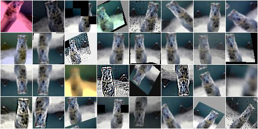

imgaug
======

`imgaug` is a library for image augmentation in machine learning experiments.
It supports a wide range of augmentation techniques, allows to easily combine
these, has a simple yet powerful stochastic interface, can augment images
and keypoints/landmarks on these and offers augmentation in background
processes for improved performance.

    Example augmentations of a single input image.

.. toctree::
   :maxdepth: 3
   :caption: Contents:

   source/installation
   source/examples_basics
   source/examples_keypoints
   source/examples_bounding_boxes
   source/parameters
   source/alpha
   source/augmenters
   source/modules

See :ref:`modindex` for API.

Indices and tables
==================

* :ref:`genindex`
* :ref:`modindex`
* :ref:`search`
