======================
Overview of Augmenters
======================

----------
Sequential
----------
List augmenter that may contain other augmenters to apply in sequence
or random order.

Apply in predefined order::

    aug = iaa.Sequential([
        iaa.Affine(translate_px={"x":-40}),
        iaa.AdditiveGaussianNoise(scale=0.1*255)
    ])

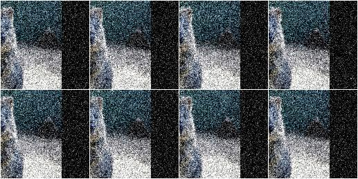

Apply in random order (note that the order is sampled once per batch and then
the same for all images within the batch)::

    aug = iaa.Sequential([
          iaa.Affine(translate_px={"x":-40}),
          iaa.AdditiveGaussianNoise(scale=0.1*255)
    ], random_order=True)

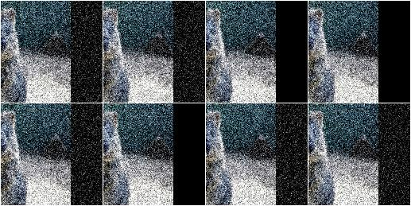

------
SomeOf
------
List augmenter that applies only some of its children to images.

Apply two of four given augmenters::

    aug = iaa.SomeOf(2, [
        iaa.Affine(rotate=45),
        iaa.AdditiveGaussianNoise(scale=0.2*255),
        iaa.Add(50, per_channel=True),
        iaa.Sharpen(alpha=0.5)
    ])

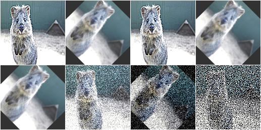

Apply 0 to <max> given augmenters (where <max> is automatically replaced with
the number of children)::

    aug = iaa.SomeOf((0, None), [
        iaa.Affine(rotate=45),
        iaa.AdditiveGaussianNoise(scale=0.2*255),
        iaa.Add(50, per_channel=True),
        iaa.Sharpen(alpha=0.5)
    ])

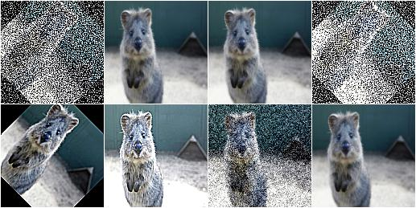

Pick two of four given augmenters and apply them in random order::

    aug = iaa.SomeOf(2, [
        iaa.Affine(rotate=45),
        iaa.AdditiveGaussianNoise(scale=0.2*255),
        iaa.Add(50, per_channel=True),
        iaa.Sharpen(alpha=0.5)
    ], random_order=True)

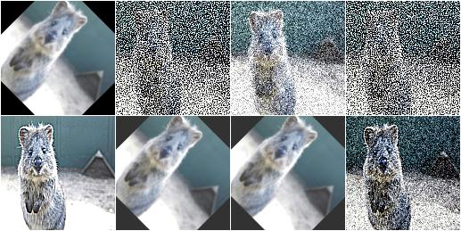

-----
OneOf
-----
Augmenter that always executes exactly one of its children.

Apply one of four augmenters to each image::

    aug = iaa.OneOf([
        iaa.Affine(rotate=45),
        iaa.AdditiveGaussianNoise(scale=0.2*255),
        iaa.Add(50, per_channel=True),
        iaa.Sharpen(alpha=0.5)
    ])

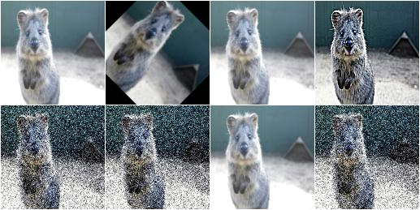

---------
Sometimes
---------
Augment only p percent of all images with one or more augmenters.

Apply gaussian blur to about 50% of all images::

    aug = iaa.Sometimes(0.5, iaa.GaussianBlur(sigma=2.0))

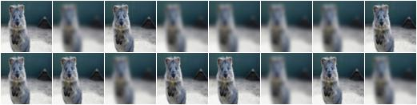

Apply gaussian blur to about 50% of all images. Apply a mixture of affine
rotations and sharpening to the other 50%. ::

    aug = iaa.Sometimes(
          0.5,
          iaa.GaussianBlur(sigma=2.0),
          iaa.Sequential([iaa.Affine(rotate=45), iaa.Sharpen(alpha=1.0)])
      )

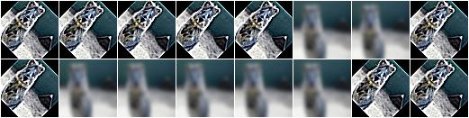

--------------
WithColorspace
--------------
Apply child augmenters within a specific colorspace.

Convert images to HSV, then increase each pixels H-value by 10 to 50::

    aug = iaa.WithColorspace(
        to_colorspace="HSV",
        from_colorspace="RGB",
        children=iaa.WithChannels(0, iaa.Add((10, 50)))
    )

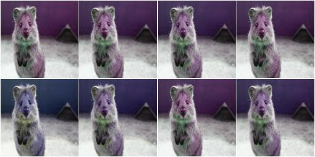

------------
WithChannels
------------
Apply child augmenters to specific channels.

Increase each pixel's R-value (redness) by 10 to 100::

    aug = iaa.WithChannels(0, iaa.Add((10, 100)))

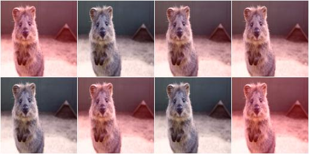

Rotate each image's red channel by 0 to 45 degrees::

    aug = iaa.WithChannels(0, iaa.Affine(rotate=(0, 45)))

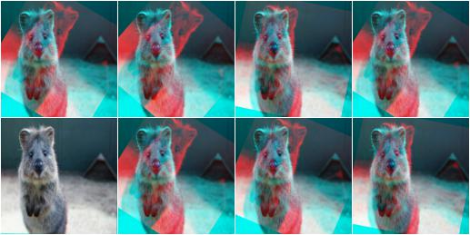

----
Noop
----
Augmenter that never changes input images ("no operation"). ::

    aug = iaa.Noop()

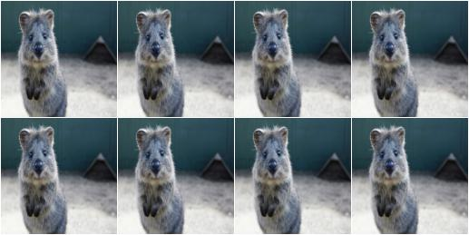

------
Lambda
------
Augmenter that calls a lambda function for each batch of input image.

Replace in every image each fourth row with black pixels::

    def img_func(images, random_state, parents, hooks):
        for img in images:
            img[::4] = 0
        return images

    def keypoint_func(keypoints_on_images, random_state, parents, hooks):
        return keypoints_on_images

    aug = iaa.Lambda(img_func, keypoint_func)

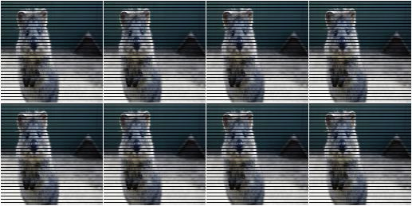

------------
AssertLambda
------------
Augmenter that runs an assert on each batch of input images
using a lambda function as condition.

TODO examples

-----------
AssertShape
-----------
Augmenter to make assumptions about the shape of input image(s)
and keypoints.

Check if each image in a batch has shape 32x32x3, otherwise raise an
exception::

    seq = iaa.Sequential([
        iaa.AssertShape((None, 32, 32, 3)),
        iaa.Fliplr(0.5) # only executed if shape matches
    ])

Check if each image in a batch has a height in the range 32<=x<64,
a width of exactly 64 and either 1 or 3 channels::

    seq = iaa.Sequential([
        iaa.AssertShape((None, (32, 64), 32, [1, 3])),
        iaa.Fliplr(0.5)
    ])

-----
Scale
-----
Augmenter that scales/resizes images to specified heights and widths.

Scale each image to height=32 and width=64::

    aug = iaa.Scale({"height": 32, "width": 64})

.. figure:: ../images/overview_of_augmenters/scale_32x64.jpg
    :alt: Scale to 32x64

Scale each image to height=32 and keep the aspect ratio for width the same::

    aug = iaa.Scale({"height": 32, "width": "keep-aspect-ratio"})

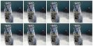

Scale each image to something between 50 and 100% of its original size::

    aug = iaa.Scale((0.5, 1.0))

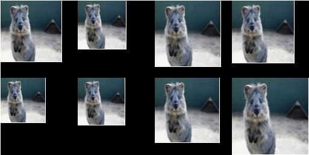

Scale each image's height to 50-75% of its original size and width to
either 16px or 32px or 64px::

    aug = iaa.Scale({"height": (0.5, 0.75), "width": [16, 32, 64]})

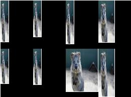

----------
CropAndPad
----------
Augmenter that crops/pads images by defined amounts in pixels or
percent (relative to input image size).

NOTE: This augmenter automatically resizes images back to their original size
after it has augmented them. To deactivate this, add the
parameter ``keep_size=False``.

Crop or pad each side by up to 10 percent relative to its original size
(negative values result in cropping, positive in padding)::

    aug = iaa.CropAndPad(percent=(-0.25, 0.25))

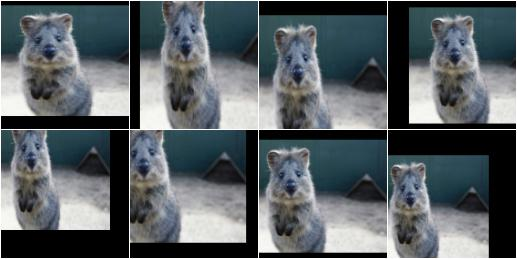

Pad each side by 0 to 20 percent. This adds new pixels to the sides. These
pixels will either be filled with a constant value (mode=constant) or filled
with the value on the closest edge (mode=edge). If a constant value is used,
it will be a random value between 0 and 128 (sampled per image). ::

    aug = iaa.CropAndPad(
        percent=(0, 0.2),
        pad_mode=["constant", "edge"],
        pad_cval=(0, 128)
    )

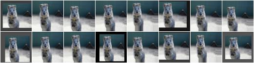

Pad the top side of each image by 0 to 30 pixels, the right side by 0-10px,
bottom side by 0-30px and left side by 0-10px. Use any of the available modes
to fill new pixels and if the mode is `constant` then use a constant value
between 0 and 128. ::

    aug = iaa.CropAndPad(
        px=((0, 30), (0, 10), (0, 30), (0, 10)),
        pad_mode=ia.ALL,
        pad_cval=(0, 128)
    )

.. figure:: ../images/overview_of_augmenters/cropandpad_pad_complex.jpg
    :alt: Distributions per side

Crop/pad each side by up to 10px. The value will be sampled once per image
and used for all sides (i.e. all sides gain/lose the same number of
rows/colums). ::

    aug = iaa.CropAndPad(
        px=(-10, 10),
        sample_independently=False
    )

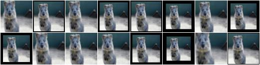

---
Pad
---
Augmenter that pads images, i.e. adds columns/rows to them.

This is a proxy for `CropAndPad`. It only accepts positive
pixel/percent values.

----
Crop
----
Augmenter that crops/cuts away pixels at the sides of the image.

This is a proxy for `CropAndPad`. It only accepts positive
pixel/percent values and transfers them as negative values to `CropAndPad`.

------
Fliplr
------
Flip/mirror input images horizontally.

Flip 50% of all images horizontally::

    aug = iaa.Fliplr(0.5)

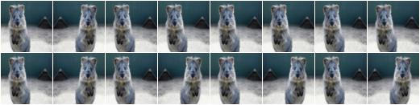

------
Flipud
------
Flip/mirror input images vertically.

Flip 50% of all images vertically::

    aug = iaa.Flipud(0.5)

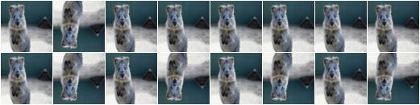

-----------
Superpixels
-----------
Completely or partially transform images to their superpixel representation.

Generate about 64 superpixels per image. Replace each one with a probability
of 50% by its average pixel color. ::

    aug = iaa.Superpixels(p_replace=0.5, n_segments=64)

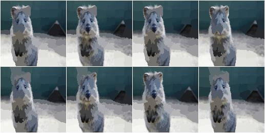

Generate 16 to 128 superpixels per image. Replace each superpixel with a
probability between 10 and 100% (sampled once per image) by its average pixel
color. ::

    aug = iaa.Superpixels(p_replace=(0.1, 1.0), n_segments=(16, 128))

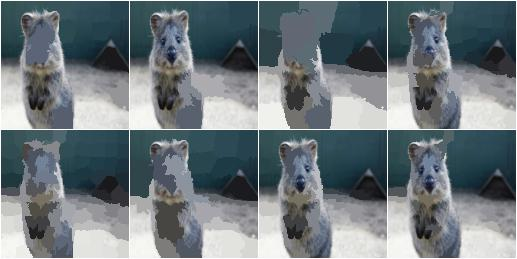

Effect of setting ``n_segments`` to a fixed value of 64 and then
increasing ``p_replace`` from 0.0 and 1.0:

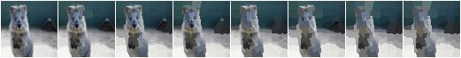

Effect of setting ``p_replace`` to a fixed value of 1.0 and then
increasing ``n_segments`` from 1\*16 to 9\*16=144:

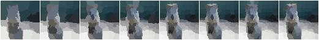

----------------
ChangeColorspace
----------------
Augmenter to change the colorspace of images.

The following example shows how to change the colorspace from RGB to HSV,
then add 50-100 to the first channel, then convert back to RGB.
This increases the hue value of each image. ::

    aug = iaa.Sequential([
        iaa.ChangeColorspace(from_colorspace="RGB", to_colorspace="HSV"),
        iaa.WithChannels(0, iaa.Add((50, 100))),
        iaa.ChangeColorspace(from_colorspace="HSV", to_colorspace="RGB")
    ])

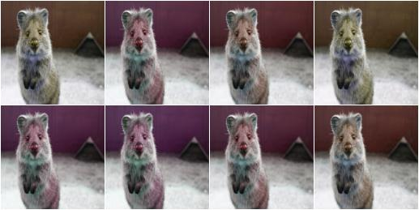

---------
Grayscale
---------
Augmenter to convert images to their grayscale versions.

Change images to grayscale and overlay them with the original image by varying
strengths, effectively removing 0 to 100% of the color::

    aug = iaa.Grayscale(alpha=(0.0, 1.0))

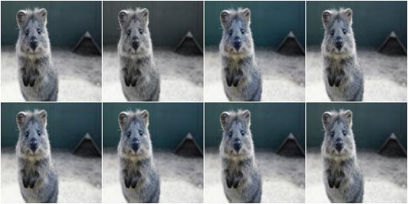

Visualization of increasing ``alpha`` from 0.0 to 1.0 in 8 steps:

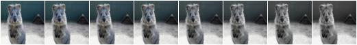

------------
GaussianBlur
------------
Augmenter to blur images using gaussian kernels.

Blur each image with a gaussian kernel with a sigma of ``3.0``::

    aug = iaa.GaussianBlur(sigma=(0.0, 3.0))

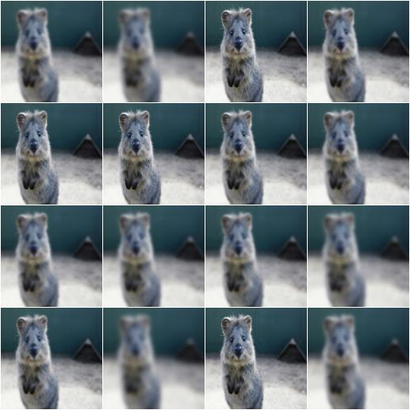

-----------
AverageBlur
-----------
Blur an image by computing simple means over neighbourhoods.

Blur each image using a mean over neihbourhoods that have a random size
between 2x2 and 11x11::

    aug = iaa.AverageBlur(k=(2, 11))

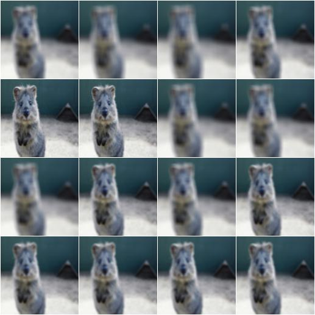

Blur each image using a mean over neihbourhoods that have random sizes,
which can vary between 5 and 11 in height and 1 and 3 in width::

    aug = iaa.AverageBlur(k=((5, 11), (1, 3)))

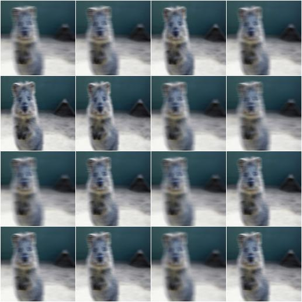

----------
MedianBlur
----------
Blur an image by computing median values over neighbourhoods.

Blur each image using a median over neihbourhoods that have a random size
between 3x3 and 11x11::

    aug = iaa.MedianBlur(k=(3, 11))

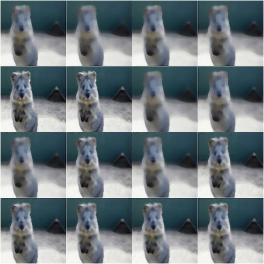

--------
Convolve
--------
Apply a Convolution to input images.

Convolve each image with a 3x3 kernel::

    matrix = np.array([[0, -1, 0],
                       [-1, 4, -1],
                       [0, -1, 0]])
    aug = iaa.Convolve(matrix=matrix)

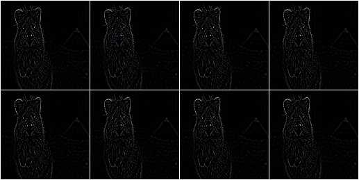

Convolve each image with a 3x3 kernel, which is chosen dynamically per
image::

    def gen_matrix(image, nb_channels, random_state):
          matrix_A = np.array([[0, -1, 0],
                               [-1, 4, -1],
                               [0, -1, 0]])
         matrix_B = np.array([[0, 0, 0],
                              [0, -4, 1],
                              [0, 2, 1]])
          if random_state.rand() < 0.5:
              return [matrix_A] * nb_channels
          else:
              return [matrix_B] * nb_channels
    aug = iaa.Convolve(matrix=gen_matrix)

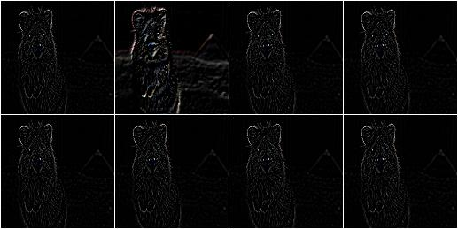

-------
Sharpen
-------
Augmenter that sharpens images and overlays the result with the original
image.

Sharpen an image, then overlay the results with the original using an alpha
between 0.0 and 1.0::

    aug = iaa.Sharpen(alpha=(0.0, 1.0), lightness=(0.75, 2.0))

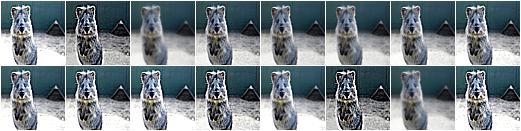

Effects of keeping ``lightness`` fixed at 1.0 and then varying ``alpha`` between
0.0 and 1.0 in 8 steps:

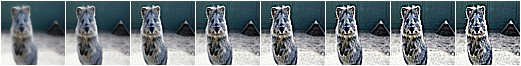

Effects of keeping ``alpha`` fixed at 1.0 and then varying ``lightness`` between
0.75 and 1.5 in 8 steps:

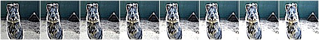

------
Emboss
------
Augmenter that embosses images and overlays the result with the original
image.

Emboss an image, then overlay the results with the original using an alpha
between 0.0 and 1.0::

    aug = iaa.Emboss(alpha=(0.0, 1.0), strength=(0.5, 1.5))

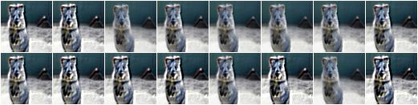

Effects of keeping ``strength`` fixed at 1.0 and then varying ``alpha`` between
0.0 and 1.0 in 8 steps:

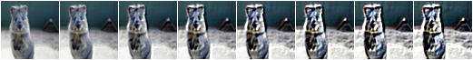

Effects of keeping ``alpha`` fixed at 1.0 and then varying ``strength`` between
0.5 and 1.5 in 8 steps:

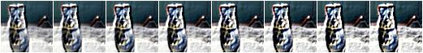

----------
EdgeDetect
----------
Augmenter that detects all edges in images, marks them in
a black and white image and then overlays the result with the original
image.

Detect edges in images, turning them into black and white images and then overlay
these with the original images using random alphas between 0.0 and 1.0::

    aug = iaa.EdgeDetect(alpha=(0.0, 1.0))

Effect of increasing ``alpha`` from 0.0 to 1.0 in 8 steps:

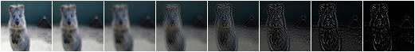

------------------
DirectedEdgeDetect
------------------
Augmenter that detects edges that have certain directions and marks them
in a black and white image and then overlays the result with the original
image.

Detect edges having random directions (0 to 360 degrees) in images,
turning the images into black and white versions and then overlay
these with the original images using random alphas between 0.0 and 1.0::

    aug = iaa.DirectedEdgeDetect(alpha=(0.0, 1.0), direction=(0.0, 1.0))

Effect of fixing ``direction`` to 0.0 and then increasing ``alpha`` from 0.0
to 1.0 in 8 steps:

.. figure:: ../images/overview_of_augmenters/directededgedetect_vary_alpha.jpg
    :alt: DirectedEdgeDetect vary alpha

Effect of fixing ``alpha`` to 1.0 and then increasing ``direction`` from 0.0
to 1.0 (0 to 360 degrees) in 8 steps:

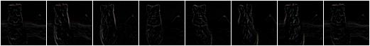

---
Add
---
Add a value to all pixels in an image.

Add random values between -40 and 40 to images, with each value being sampled
once per image and then being the same for all pixels::

    aug = iaa.Add((-40, 40))

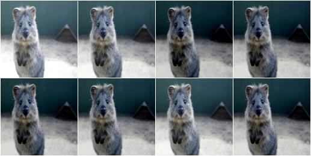

Add random values between -40 and 40 to images. In 50% of all images the
values differ per channel (3 sampled value). In the other 50% of all images
the value is the same for all channels::

    aug = iaa.Add((-40, 40), per_channel=0.5)

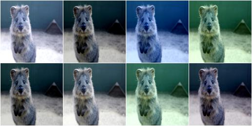

--------------
AddElementwise
--------------
Add values to the pixels of images with possibly different values
for neighbouring pixels.

Add random values between -40 and 40 to images, with each value being sampled
per pixel::

    aug = iaa.AddElementwise((-40, 40))

Add random values between -40 and 40 to images. In 50% of all images the
values differ per channel (3 sampled values per pixel).
In the other 50% of all images the value is the same for all channels per pixel::

    aug = iaa.AddElementwise((-40, 40), per_channel=0.5)

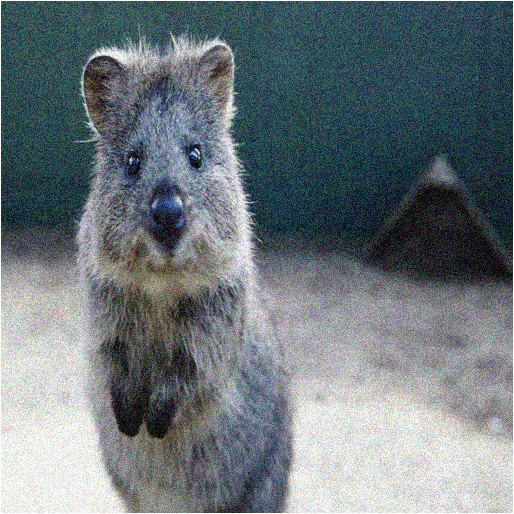

---------------------
AdditiveGaussianNoise
---------------------
Add gaussian noise (aka white noise) to images.

Add gaussian noise to an image, sampled once per pixel from a normal
distribution ``N(0, s)``, where ``s`` is sampled per image and varies between
0 and 0.05\*255::

    aug = iaa.AdditiveGaussianNoise(scale=(0, 0.05*255))

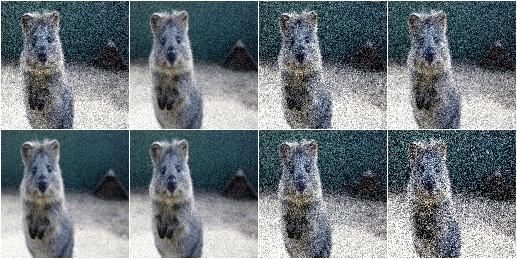

Add gaussian noise to an image, sampled once per pixel from a normal
distribution ``N(0, 0.05*255)``::

    aug = iaa.AdditiveGaussianNoise(scale=0.05*255)

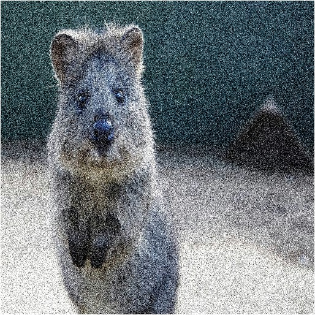

Add gaussian noise to an image, sampled once per pixel from a normal
distribution ``N(0, 0.05*255)`` for 50% of all images and sampled three times
(channel-wise) for the other 50% from the same normal distribution::

    aug = iaa.AdditiveGaussianNoise(scale=0.05*255, per_channel=0.5)

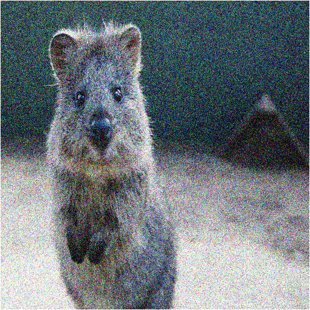

--------
Multiply
--------
Multiply all pixels in an image with a specific value, thereby making the
image darker or brighter.

Multiply each image with a random value between 0.5 and 1.5::

    aug = iaa.Multiply((0.5, 1.5))

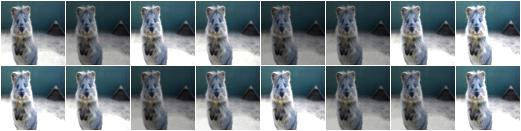

Multiply 50% of all images with a random value between 0.5 and 1.5
and multiply the remaining 50% channel-wise, i.e. sample one multiplier
independently per channel::

    aug = iaa.Multiply((0.5, 1.5), per_channel=0.5)

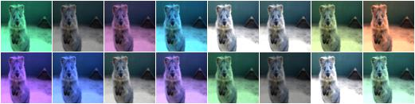

-------------------
MultiplyElementwise
-------------------
Multiply values of pixels with possibly different values for neighbouring
pixels, making each pixel darker or brighter.

Multiply each pixel with a random value between 0.5 and 1.5::

    aug = iaa.MultiplyElementwise((0.5, 1.5))

Multiply in 50% of all images each pixel with random values between 0.5 and 1.5
and multiply in the remaining 50% of all images the pixels channel-wise, i.e.
sample one multiplier independently per channel and pixel::

    aug = iaa.MultiplyElementwise((0.5, 1.5), per_channel=0.5)

-------
Dropout
-------
Augmenter that sets a certain fraction of pixels in images to zero.

Sample per image a value p from the range 0<=p<=0.2 and then drop p percent
of all pixels in the image (i.e. convert them to black pixels)::

    aug = iaa.Dropout(p=(0, 0.2))

Sample per image a value p from the range 0<=p<=0.2 and then drop p percent
of all pixels in the image (i.e. convert them to black pixels), but
do this independently per channel in 50% of all images::

    aug = iaa.Dropout(p=(0, 0.2), per_channel=0.5)

-------------
CoarseDropout
-------------
Augmenter that sets rectangular areas within images to zero.

Drop 2% of all pixels by converting them to black pixels, but do
that on a lower-resolution version of the image that has 50% of the original
size, leading to 2x2 squares being dropped::

    aug = iaa.CoarseDropout(0.02, size_percent=0.5)

Drop 0 to 5% of all pixels by converting them to black pixels, but do
that on a lower-resolution version of the image that has 5% to 50% of the
original size, leading to large rectangular areas being dropped::

    aug = iaa.CoarseDropout((0.0, 0.05), size_percent=(0.02, 0.25))

Drop 2% of all pixels by converting them to black pixels, but do
that on a lower-resolution version of the image that has 50% of the original
size, leading to 2x2 squares being dropped. Also do this in 50% of all
images channel-wise, so that only the information of some channels in set
to 0 while others remain untouched::

    aug = iaa.CoarseDropout(0.02, size_percent=0.15, per_channel=0.5)

------
Invert
------
Augmenter that inverts all values in images, i.e. sets a pixel from value
``v`` to ``255-v``.

Invert in 50% of all images all pixels:

    aug = iaa.Invert(0.5)

For 50% of all images, invert all pixels in these images with 25% probability
(per image). In the remaining 50% of all images, invert 25% of all channels::

    aug = iaa.Invert(0.25, per_channel=0.5)

---------------------
ContrastNormalization
---------------------
Augmenter that changes the contrast of images.

Normalize contrast by a factor of 0.5 to 1.5, sampled randomly per image::

    aug = iaa.ContrastNormalization((0.5, 1.5))

Normalize contrast by a factor of 0.5 to 1.5, sampled randomly per image
and for 50% of all images also independently per channel::

    aug = iaa.ContrastNormalization((0.5, 1.5), per_channel=0.5)

------
Affine
------
Augmenter to apply affine transformations to images.

Scale images to a value of 50 to 150% of their original size::

    aug = iaa.Affine(scale=(0.5, 1.5))

Scale images to a value of 50 to 150% of their original size,
but do this independently per axis (i.e. sample two values per image)::

    aug = iaa.Affine(scale={"x": (0.5, 1.5), "y": (0.5, 1.5)})

Translate images by -20 to +20% on x- and y-axis independently::

    aug = iaa.Affine(translate_percent={"x": (-0.2, 0.2), "y": (-0.2, 0.2)})

Translate images by -20 to 20 pixels on x- and y-axis independently::

    aug = iaa.Affine(translate_px={"x": (-20, 20), "y": (-20, 20)})

Rotate images by -45 to 45 degrees::

    aug = iaa.Affine(rotate=(-45, 45))

Shear images by -16 to 16 degrees::

    aug = iaa.Affine(shear=(-16, 16))

.. figure:: ../images/overview_of_augmenters/affine_shear.jpg
    :alt: Affine shear

When applying affine transformations, new pixels are often generated, e.g. when
translating to the left, pixels are generated on the right. Various modes
exist to set how these pixels are ought to be filled. Below code shows an
example that uses all modes, sampled randomly per image. If the mode is
`constant` (fill all with one constant value), then a random brightness
between 0 and 255 is used::

    aug = iaa.Affine(translate_percent={"x": -0.20}, mode=ia.ALL, cval=(0, 255))

---------------
PiecewiseAffine
---------------
Augmenter that places a regular grid of points on an image and randomly
moves the neighbourhood of these point around via affine transformations.
This leads to local distortions.

Distort images locally by moving points around, each with a distance v (percent
relative to image size), where v is sampled per point from ``N(0, z)``
``z`` is sampled per image from the range 0.01 to 0.05::

    aug = iaa.PiecewiseAffine(scale=(0.01, 0.05))

Effect of increasing ``scale`` from 0.01 to 0.3 in 8 steps:

PiecewiseAffine works by placing a regular grid of points on the image
and moving them around. By default this grid consists of 4x4 points.
The below image shows the effect of increasing that value from 2x2 to 16x16
in 8 steps:

---------------------
ElasticTransformation
---------------------
Augmenter to transform images by moving pixels locally around using
displacement fields.

Distort images locally by moving individual pixels around following
a distortions field with strength 0.25. The strength of the movement is
sampled per pixel from the range 0 to 5.0::

    aug = iaa.ElasticTransformation(alpha=(0, 5.0), sigma=0.25)

Effect of keeping sigma fixed at 0.25 and increasing alpha from 0 to 5.0
in 8 steps:

Effect of keeping alpha fixed at 2.5 and increasing sigma from 0.01 to 1.0
in 8 steps:

