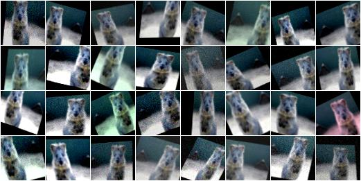

================
Examples: Basics
================

A standard use case
-------------------

The following example shows a standard use case.
An augmentation sequence (crop + horizontal flips + gaussian blur) is defined
once at the start of the script. Then many batches are loaded and augmented
before being used for training. ::

    from imgaug import augmenters as iaa

    seq = iaa.Sequential([
        iaa.Crop(px=(0, 16)), # crop images from each side by 0 to 16px (randomly chosen)
        iaa.Fliplr(0.5), # horizontally flip 50% of the images
        iaa.GaussianBlur(sigma=(0, 3.0)) # blur images with a sigma of 0 to 3.0
    ])

    for batch_idx in range(1000):
        # 'images' should be either a 4D numpy array of shape (N, height, width, channels)
        # or a list of 3D numpy arrays, each having shape (height, width, channels).
        # Grayscale images must have shape (height, width, 1) each.
        # All images must have numpy's dtype uint8. Values are expected to be in
        # range 0-255.
        images = load_batch(batch_idx)
        images_aug = seq.augment_images(images)
        train_on_images(images_aug)

A simple and common augmentation sequence
-----------------------------------------

The following example shows an augmentation sequence that might be useful
for many common experiments. It applies crops and affine transformations
to images, flips some of the images horizontally, adds a bit of noise and blur
and also changes the contrast as well as brightness. ::

    import imgaug as ia
    from imgaug import augmenters as iaa
    import numpy as np

    ia.seed(1)

    # Example batch of images.
    # The array has shape (32, 64, 64, 3) and dtype uint8.
    images = np.array(
        [ia.quokka(size=(64, 64)) for _ in range(32)],
        dtype=np.uint8
    )

    seq = iaa.Sequential([
        iaa.Fliplr(0.5), # horizontal flips
        iaa.Crop(percent=(0, 0.1)), # random crops
        # Small gaussian blur with random sigma between 0 and 0.5.
        # But we only blur about 50% of all images.
        iaa.Sometimes(0.5,
            iaa.GaussianBlur(sigma=(0, 0.5))
        ),
        # Strengthen or weaken the contrast in each image.
        iaa.ContrastNormalization((0.75, 1.5)),
        # Add gaussian noise.
        # For 50% of all images, we sample the noise once per pixel.
        # For the other 50% of all images, we sample the noise per pixel AND
        # channel. This can change the color (not only brightness) of the
        # pixels.
        iaa.AdditiveGaussianNoise(loc=0, scale=(0.0, 0.05*255), per_channel=0.5),
        # Make some images brighter and some darker.
        # In 20% of all cases, we sample the multiplier once per channel,
        # which can end up changing the color of the images.
        iaa.Multiply((0.8, 1.2), per_channel=0.2),
        # Apply affine transformations to each image.
        # Scale/zoom them, translate/move them, rotate them and shear them.
        iaa.Affine(
            scale={"x": (0.8, 1.2), "y": (0.8, 1.2)},
            translate_percent={"x": (-0.2, 0.2), "y": (-0.2, 0.2)},
            rotate=(-25, 25),
            shear=(-8, 8)
        )
    ], random_order=True) # apply augmenters in random order

    images_aug = seq.augment_images(images)

    Example results of the above simple augmentation sequence.

Heavy Augmentations
-------------------

The following example shows a large augmentation sequence containing many
different augmenters, leading to  significant changes in the augmented images.
Depending on the use case, the sequence might be too strong. Occasionally
it can also break images by changing them too much. To weaken the effects
you can lower the value of ``iaa.SomeOf((0, 5), ...)`` to e.g. ``(0, 3)``
or decrease the probability of some augmenters to be applied by decreasing in
``sometimes = lambda aug: iaa.Sometimes(0.5, aug)`` the value ``0.5`` to e.g.
``0.3``. ::

    import imgaug as ia
    from imgaug import augmenters as iaa
    import numpy as np

    ia.seed(1)

    # Example batch of images.
    # The array has shape (32, 64, 64, 3) and dtype uint8.
    images = np.array(
        [ia.quokka(size=(64, 64)) for _ in range(32)],
        dtype=np.uint8
    )

    # Sometimes(0.5, ...) applies the given augmenter in 50% of all cases,
    # e.g. Sometimes(0.5, GaussianBlur(0.3)) would blur roughly every second
    # image.
    sometimes = lambda aug: iaa.Sometimes(0.5, aug)

    # Define our sequence of augmentation steps that will be applied to every image.
    seq = iaa.Sequential(
        [
            #
            # Apply the following augmenters to most images.
            #
            iaa.Fliplr(0.5), # horizontally flip 50% of all images
            iaa.Flipud(0.2), # vertically flip 20% of all images

            # crop some of the images by 0-10% of their height/width
            sometimes(iaa.Crop(percent=(0, 0.1))),

            # Apply affine transformations to some of the images
            # - scale to 80-120% of image height/width (each axis independently)
            # - translate by -20 to +20 relative to height/width (per axis)
            # - rotate by -45 to +45 degrees
            # - shear by -16 to +16 degrees
            # - order: use nearest neighbour or bilinear interpolation (fast)
            # - mode: use any available mode to fill newly created pixels
            #         see API or scikit-image for which modes are available
            # - cval: if the mode is constant, then use a random brightness
            #         for the newly created pixels (e.g. sometimes black,
            #         sometimes white)
            sometimes(iaa.Affine(
                scale={"x": (0.8, 1.2), "y": (0.8, 1.2)},
                translate_percent={"x": (-0.2, 0.2), "y": (-0.2, 0.2)},
                rotate=(-45, 45),
                shear=(-16, 16),
                order=[0, 1],
                cval=(0, 255),
                mode=ia.ALL
            )),

            #
            # Execute 0 to 5 of the following (less important) augmenters per
            # image. Don't execute all of them, as that would often be way too
            # strong.
            #
            iaa.SomeOf((0, 5),
                [
                    # Convert some images into their superpixel representation,
                    # sample between 20 and 200 superpixels per image, but do
                    # not replace all superpixels with their average, only
                    # some of them (p_replace).
                    sometimes(
                        iaa.Superpixels(
                            p_replace=(0, 1.0),
                            n_segments=(20, 200)
                        )
                    ),

                    # Blur each image with varying strength using
                    # gaussian blur (sigma between 0 and 3.0),
                    # average/uniform blur (kernel size between 2x2 and 7x7)
                    # median blur (kernel size between 3x3 and 11x11).
                    iaa.OneOf([
                        iaa.GaussianBlur((0, 3.0)),
                        iaa.AverageBlur(k=(2, 7)),
                        iaa.MedianBlur(k=(3, 11)),
                    ]),

                    # Sharpen each image, overlay the result with the original
                    # image using an alpha between 0 (no sharpening) and 1
                    # (full sharpening effect).
                    iaa.Sharpen(alpha=(0, 1.0), lightness=(0.75, 1.5)),

                    # Same as sharpen, but for an embossing effect.
                    iaa.Emboss(alpha=(0, 1.0), strength=(0, 2.0)),

                    # Search in some images either for all edges or for
                    # directed edges. These edges are then marked in a black
                    # and white image and overlayed with the original image
                    # using an alpha of 0 to 0.7.
                    sometimes(iaa.OneOf([
                        iaa.EdgeDetect(alpha=(0, 0.7)),
                        iaa.DirectedEdgeDetect(
                            alpha=(0, 0.7), direction=(0.0, 1.0)
                        ),
                    ])),

                    # Add gaussian noise to some images.
                    # In 50% of these cases, the noise is randomly sampled per
                    # channel and pixel.
                    # In the other 50% of all cases it is sampled once per
                    # pixel (i.e. brightness change).
                    iaa.AdditiveGaussianNoise(
                        loc=0, scale=(0.0, 0.05*255), per_channel=0.5
                    ),

                    # Either drop randomly 1 to 10% of all pixels (i.e. set
                    # them to black) or drop them on an image with 2-5% percent
                    # of the original size, leading to large dropped
                    # rectangles.
                    iaa.OneOf([
                        iaa.Dropout((0.01, 0.1), per_channel=0.5),
                        iaa.CoarseDropout(
                            (0.03, 0.15), size_percent=(0.02, 0.05),
                            per_channel=0.2
                        ),
                    ]),

                    # Invert each image's chanell with 5% probability.
                    # This sets each pixel value v to 255-v.
                    iaa.Invert(0.05, per_channel=True), # invert color channels

                    # Add a value of -10 to 10 to each pixel.
                    iaa.Add((-10, 10), per_channel=0.5),

                    # Change brightness of images (50-150% of original value).
                    iaa.Multiply((0.5, 1.5), per_channel=0.5),

                    # Improve or worsen the contrast of images.
                    iaa.ContrastNormalization((0.5, 2.0), per_channel=0.5),

                    # Convert each image to grayscale and then overlay the
                    # result with the original with random alpha. I.e. remove
                    # colors with varying strengths.
                    iaa.Grayscale(alpha=(0.0, 1.0)),

                    # In some images move pixels locally around (with random
                    # strengths).
                    sometimes(
                        iaa.ElasticTransformation(alpha=(0.5, 3.5), sigma=0.25)
                    ),

                    # In some images distort local areas with varying strength.
                    sometimes(iaa.PiecewiseAffine(scale=(0.01, 0.05)))
                ],
                # do all of the above augmentations in random order
                random_order=True
            )
        ],
        # do all of the above augmentations in random order
        random_order=True
    )

    images_aug = seq.augment_images(images)

.. figure:: ../images/examples_basics/heavy.jpg
    :alt: Heavy augmentations

    Example results of the above heavy augmentation sequence.
