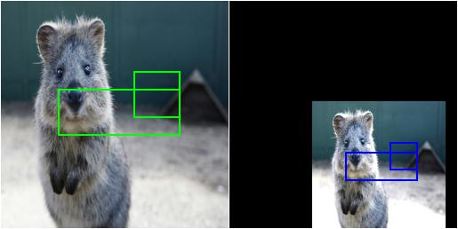
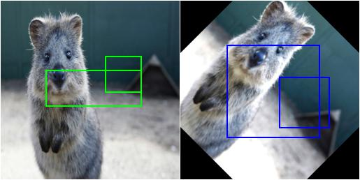
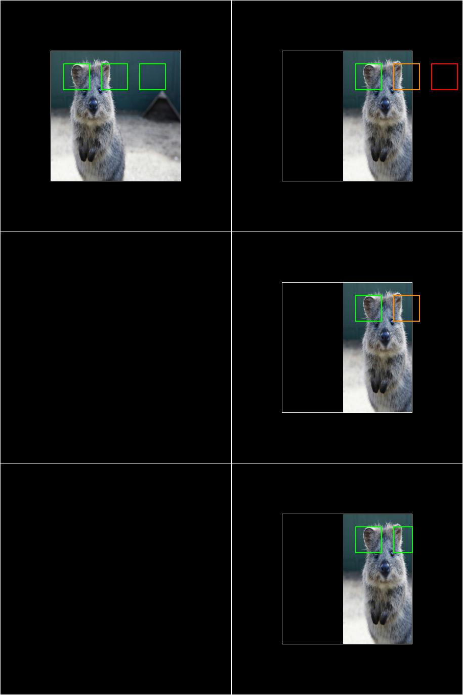
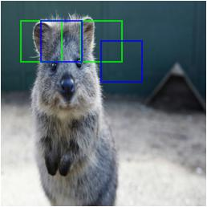
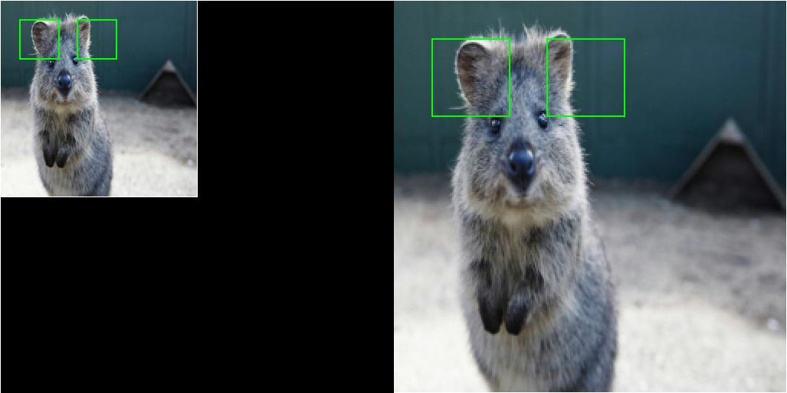
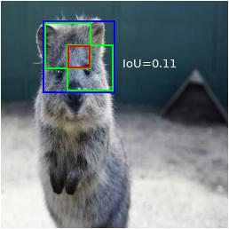

========================
Examples: Bounding Boxes
========================

`imgaug` offers support for bounding boxes (aka rectangles, regions of interest).
E.g. if an image is rotated during augmentation, the library can also rotate
all bounding boxes on it correspondingly.

Features of the library's bounding box support:

  * Represent bounding boxes as objects (`imgaug.BoundingBox`).
  * Augment bounding boxes.
  * Draw bounding boxes on images.
  * Move/shift bounding boxes on images,
    project them onto other images (e.g. onto the same image after resizing),
    compute their intersections/unions and IoU values.

A simple example
----------------

The following example loads an image and places two bounding boxes on it.
The image is then augmented to be brighter, slightly rotated and scaled.
These augmentations are also applied to the bounding boxes.
The image is then shown before and after augmentation (with bounding boxes
drawn on it).

::

    import imgaug as ia
    from imgaug import augmenters as iaa

    ia.seed(1)

    image = ia.quokka(size=(256, 256))
    bbs = ia.BoundingBoxesOnImage([
        ia.BoundingBox(x1=65, y1=100, x2=200, y2=150),
        ia.BoundingBox(x1=150, y1=80, x2=200, y2=130)
    ], shape=image.shape)

    seq = iaa.Sequential([
        iaa.Multiply((1.2, 1.5)), # change brightness, doesn't affect BBs
        iaa.Affine(
            translate_px={"x": 40, "y": 60},
            scale=(0.5, 0.7)
        ) # translate by 40/60px on x/y axis, and scale to 50-70%, affects BBs
    ])

    # Make our sequence deterministic.
    # We can now apply it to the image and then to the BBs and it will
    # lead to the same augmentations.
    # IMPORTANT: Call this once PER BATCH, otherwise you will always get the
    # exactly same augmentations for every batch!
    seq_det = seq.to_deterministic()

    # Augment BBs and images.
    # As we only have one image and list of BBs, we use
    # [image] and [bbs] to turn both into lists (batches) for the
    # functions and then [0] to reverse that. In a real experiment, your
    # variables would likely already be lists.
    image_aug = seq_det.augment_images([image])[0]
    bbs_aug = seq_det.augment_bounding_boxes([bbs])[0]

    # print coordinates before/after augmentation (see below)
    # use .x1_int, .y_int, ... to get integer coordinates
    for i in range(len(bbs.bounding_boxes)):
        before = bbs.bounding_boxes[i]
        after = bbs_aug.bounding_boxes[i]
        print("BB %d: (%.4f, %.4f, %.4f, %.4f) -> (%.4f, %.4f, %.4f, %.4f)" % (
            i,
            before.x1, before.y1, before.x2, before.y2,
            after.x1, after.y1, after.x2, after.y2)
        )

    # image with BBs before/after augmentation (shown below)
    image_before = bbs.draw_on_image(image, thickness=2)
    image_after = bbs_aug.draw_on_image(image_aug, thickness=2, color=[0, 0, 255])

Console output of the example::

    BB 0: (65.0000, 100.0000, 200.0000, 150.0000) -> (130.7524, 171.3311, 210.1272, 200.7291)
    BB 1: (150.0000, 80.0000, 200.0000, 130.0000) -> (180.7291, 159.5718, 210.1272, 188.9699)

    Image with bounding boxes, before (left) and after (right)
    augmentation. Bounding boxes are shown in green (before augmentation) and
    blue (after augmentation).

Note that the bounding box augmentation works by augmenting each box's edge
coordinates and then drawing a bounding box around these augmented
coordinates. Each of these new bounding boxes is therefore axis-aligned.
This can sometimes lead to oversized new bounding boxes,
especially in the case of rotation. The following image shows the result
of the same code as in the example above, but `Affine` was replaced by
`Affine(rotate=45)`:

    Image with bounding boxes, before (left) and after (right)
    augmentation. The image was augmentated by rotating it by 45 degrees.
    The axis-aligned bounding box around the augmented keypoints ends up
    being oversized.

Dealing with bounding boxes outside of the image
------------------------------------------------

When augmenting images and their respective bounding boxes, the boxes
can end up fully or partially outside of the image plane. By default, the
library still returns these boxes, even though that may not be desired.
The following example shows how to (a) remove bounding boxes that are
fully/partially outside of the image and (b) how to cut bounding boxes that
are partially outside of the image so that their are fully inside.

::

    import imgaug as ia
    from imgaug import augmenters as iaa
    import numpy as np

    ia.seed(1)

    GREEN = [0, 255, 0]
    ORANGE = [255, 140, 0]
    RED = [255, 0, 0]

    # Pad image with a 1px white and (BY-1)px black border
    def pad(image, by):
        if by <= 0:
            return image
        image_border1 = np.pad(
            image, ((1, 1), (1, 1), (0, 0)),
            mode="constant", constant_values=255
        )
        image_border2 = np.pad(
            image_border1, ((by-1, by-1), (by-1, by-1), (0, 0)),
            mode="constant", constant_values=0
        )

        return image_border2

    # Draw BBs on an image
    # and before doing that, extend the image plane by BORDER pixels.
    # Mark BBs inside the image plane with green color, those partially inside
    # with orange and those fully outside with red.
    def draw_bbs(image, bbs, border):
        image_border = pad(image, border)
        for bb in bbs.bounding_boxes:
            if bb.is_fully_within_image(image.shape):
                color = GREEN
            elif bb.is_partly_within_image(image.shape):
                color = ORANGE
            else:
                color = RED
            image_border = bb.shift(left=border, top=border)\
                             .draw_on_image(image_border, thickness=2, color=color)

        return image_border

    # Define example image with three small square BBs next to each other.
    # Augment these BBs by shifting them to the right.
    image = ia.quokka(size=(256, 256))
    bbs = ia.BoundingBoxesOnImage([
        ia.BoundingBox(x1=25, x2=75, y1=25, y2=75),
        ia.BoundingBox(x1=100, x2=150, y1=25, y2=75),
        ia.BoundingBox(x1=175, x2=225, y1=25, y2=75)
    ], shape=image.shape)

    seq = iaa.Affine(translate_px={"x": 120})
    seq_det = seq.to_deterministic()

    image_aug = seq_det.augment_images([image])[0]
    bbs_aug = seq_det.augment_bounding_boxes([bbs])[0]

    # Draw the BBs (a) in their original form, (b) after augmentation,
    # (c) after augmentation and removing those fully outside the image,
    # (d) after augmentation and removing those fully outside the image and
    # cutting those partially inside the image so that they are fully inside.
    image_before = draw_bbs(image, bbs, 100)
    image_after1 = draw_bbs(image_aug, bbs_aug, 100)
    image_after2 = draw_bbs(image_aug, bbs_aug.remove_out_of_image(), 100)
    image_after3 = draw_bbs(image_aug, bbs_aug.remove_out_of_image().cut_out_of_image(), 100)

    Results of the above example code. Top left: Original/unaugmented image
    with bounding boxes (here visualized with an additional black border
    around the image). Right, top: Image after augmentation (translation
    120px to the right). One bounding box is now fully outside of the image area
    (red), one is partially outside of it (orange). Right, middle: After using
    `.remove_out_of_image()` the BB that was fully outside of the image area
    was removed. Right, center: After using `.remove_out_of_image()` and
    `.cut_out_of_image()`, one BB was removed and the one partially outside of
    of image area was cut to be fully inside it.

Shifting/Moving Bounding Boxes
------------------------------

The function `shift(top=<int>, right=<int>, bottom=<int>, left=<int>)` can be
used to change the x/y position of all or specific bounding boxes.

::

    import imgaug as ia
    from imgaug import augmenters as iaa

    ia.seed(1)

    # Define image and two bounding boxes
    image = ia.quokka(size=(256, 256))
    bbs = ia.BoundingBoxesOnImage([
        ia.BoundingBox(x1=25, x2=75, y1=25, y2=75),
        ia.BoundingBox(x1=100, x2=150, y1=25, y2=75)
    ], shape=image.shape)

    # Move both BBs 25px to the right and the second BB 25px down
    bbs_shifted = bbs.shift(left=25)
    bbs_shifted.bounding_boxes[1] = bbs_shifted.bounding_boxes[1].shift(top=25)

    # Draw images before/after moving BBs
    image = bbs.draw_on_image(image, color=[0, 255, 0], thickness=2, alpha=0.75)
    image = bbs_shifted.draw_on_image(image, color=[0, 0, 255], thickness=2, alpha=0.75)

    Using `shift()` to move bounding boxes around (green: original BBs, blue: shifted/moved BBs).

Projection of BBs Onto Rescaled Images
--------------------------------------

Bounding boxes can easily be projected onto rescaled versions of the same
image using the function `.on(image)`. This changes the coordinates of the
bounding boxes. E.g. if the top left coordinate of the bounding box was before
at x=10% and y=15%, it will still be at x/y 10%/15% on the new image, though
the absolute pixel values will change depending on the height/width of the new
image.

::

    import imgaug as ia
    from imgaug import augmenters as iaa

    ia.seed(1)

    # Define image with two bounding boxes
    image = ia.quokka(size=(256, 256))
    bbs = ia.BoundingBoxesOnImage([
        ia.BoundingBox(x1=25, x2=75, y1=25, y2=75),
        ia.BoundingBox(x1=100, x2=150, y1=25, y2=75)
    ], shape=image.shape)

    # Rescale image and bounding boxes
    image_rescaled = ia.imresize_single_image(image, (512, 512))
    bbs_rescaled = bbs.on(image_rescaled)

    # Draw image before/after rescaling and with rescaled bounding boxes
    image_bbs = bbs.draw_on_image(image, thickness=2)
    image_rescaled_bbs = bbs_rescaled.draw_on_image(image_rescaled, thickness=2)

    Using `on()` to project bounding boxes from one image to the other,
    here onto an image of 2x the original size. New coordinates are determined
    based on their relative positions on the old image.

Computing Intersections, Unions and IoUs
----------------------------------------

Computing intersections, unions and especially IoU values (intersection over union)
is common for many machine learning experiments. The library offers easy
functions for that.

::

    import imgaug as ia
    from imgaug import augmenters as iaa
    import numpy as np

    ia.seed(1)

    # Define image with two bounding boxes.
    image = ia.quokka(size=(256, 256))
    bb1 = ia.BoundingBox(x1=50, x2=100, y1=25, y2=75)
    bb2 = ia.BoundingBox(x1=75, x2=125, y1=50, y2=100)

    # Compute intersection, union and IoU value
    # Intersection and union are both bounding boxes. They are here
    # decreased/increased in size purely for better visualization.
    bb_inters = bb1.intersection(bb2).extend(all_sides=-1)
    bb_union = bb1.union(bb2).extend(all_sides=2)
    iou = bb1.iou(bb2)

    # Draw bounding boxes, intersection, union and IoU value on image.
    image_bbs = np.copy(image)
    image_bbs = bb1.draw_on_image(image_bbs, thickness=2, color=[0, 255, 0])
    image_bbs = bb2.draw_on_image(image_bbs, thickness=2, color=[0, 255, 0])
    image_bbs = bb_inters.draw_on_image(image_bbs, thickness=2, color=[255, 0, 0])
    image_bbs = bb_union.draw_on_image(image_bbs, thickness=2, color=[0, 0, 255])
    image_bbs = ia.draw_text(
        image_bbs, text="IoU=%.2f" % (iou,),
        x=bb_union.x2+10, y=bb_union.y1+bb_union.height//2,
        color=[255, 255, 255], size=13
    )

    Two bounding boxes on an image (green), their intersection (red, slightly shrunk),
    their union (blue, slightly extended) and their IoU value (white).
