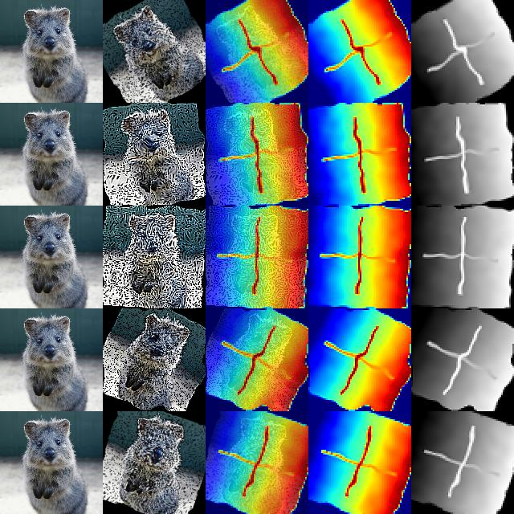
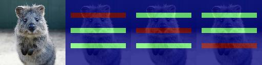
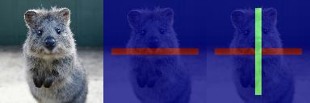
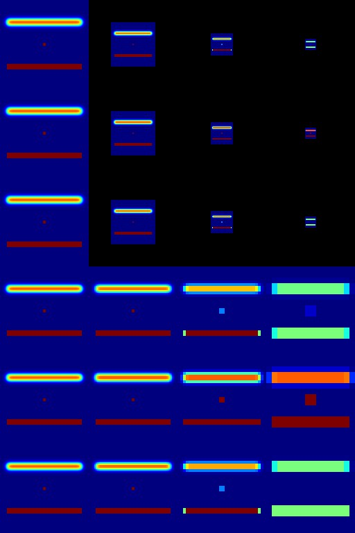
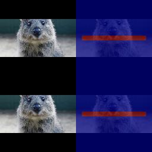

========================
Examples: Heatmaps
========================

`imgaug` offers support for heatmap-like data. This can be used e.g. for depth map or
keypoint/landmark localization maps. Heatmaps can be augmented correspondingly to images,
e.g. if an image is rotated by 45°, the corresponding heatmap for that image will also be
rotated by 45°.

_Note_:

  * Heatmap support is currently in a Beta phase. Unittests are not yet finished.
  * Heatmaps have to be bounded within value ranges, e.g. `0.0` to `1.0` for keypoint localization
    maps or something like `0.0` to `200.0` (meters) for depth maps. Choosing arbitrarily low/high
    min/max values for unbounded heatmaps is not recommended as it could lead to numerical
    inaccuracies.
  * All augmentation functions for heatmaps are implemented under the assumption of
    augmenting *ground truth* data. As such, heatmaps will be affected by augmentations that change
    the geometry of images (e.g. affine transformations, cropping, resizing), but not by other
    augmentations (e.g. gaussian noise, saturation changes, grayscaling, dropout, ...).

Features of the library's heatmap support:

  * Represent heatmaps as objects (`imgaug.HeatmapsOnImage`).
  * Augment heatmaps (only geometry-affecting augmentations,
    e.g. affine transformations, cropping, ...).
  * Use different resolutions for heatmaps than for images (e.g. 32x32 heatmaps for
    256x256 images).
  * Draw heatmaps -- on their own or on images (`imgaug.HeatmapsOnImage.draw()`,
    `imgaug.HeatmapsOnImage.draw_on_image()`).
  * Resize, average pool or max pool heatmaps (`imgaug.HeatmapsOnImage.scale()`,
    `imgaug.HeatmapsOnImage.avg_pool()`, `imgaug.HeatmapsOnImage.max_pool()`).
  * Pad heatmaps by pixel amounts or to desired aspect ratios (`imgaug.HeatmapsOnImage.pad()`,
    `imgaug.HeatmapsOnImage.pad_to_aspect_ratio()`).

A simple example
----------------

The following example loads a standard image and a generates a corresponding heatmap.
The heatmap is supposed to be a depth map, i.e. is supposed to resemble the depth of objects
in the image, where higher values indicate that objects are further away. (For simplicity we
just use a simple gradient as a depth map with a cross in the center, so there is no real
correspondence between the image and the depth values.)

This example shows:

  * Creating heatmaps via `imgaug.HeatmapsOnImage(heatmap_array, shape=image_shape)`.
  * Using value ranges outside of simple `0.0` to `1.0` (here `0.0` to `50.0`) by setting
    `min_value` and `max_value` in the HeatmapsOnImage contructor.
  * Resizing heatmaps, here via `HeatmapsOnImage.avg_pool(kernel_size)` (i.e. average pooling).
  * Augmenting heatmaps via `Augmenter.augment_heatmaps()`.
  * Drawing heatmaps as overlays over images `HeatmapsOnImage.draw_on_image(image)`.
  * Drawing heatmaps on their own via `HeatmapsOnImage.draw()` in jet color map or via
    `HeatmapsOnImage.draw(cmap=None)` as intensity maps.

::

    import imgaug as ia
    from imgaug import augmenters as iaa
    import imageio
    import numpy as np

    ia.seed(1)

    # Load an example image (uint8, 128x128x3).
    image = ia.quokka(size=(128, 128), extract="square")

    # Create an example depth map (float32, 128x128).
    # Here, we use a simple gradient that has low values (around 0.0) towards the left of the image
    # and high values (around 50.0) towards the right. This is obviously a very unrealistic depth
    # map, but makes the example easier.
    depth = np.linspace(0, 50, 128).astype(np.float32)  # 128 values from 0.0 to 50.0
    depth = np.tile(depth.reshape(1, 128), (128, 1))    # change to a horizontal gradient

    # We add a cross to the center of the depth map, so that we can more easily see the
    # effects of augmentations.
    depth[64-2:64+2, 16:128-16] = 0.75 * 50.0  # line from left to right
    depth[16:128-16, 64-2:64+2] = 1.0 * 50.0   # line from top to bottom

    # Convert our numpy array depth map to a heatmap object.
    # We have to add the shape of the underlying image, as that is necessary for some
    # augmentations.
    depth = ia.HeatmapsOnImage(depth, shape=image.shape, min_value=0.0, max_value=50.0)

    # To save some computation time, we want our models to perform downscaling and
    # hence need the ground truth depth maps to be at a resolution of 64x64 instead of
    # the 128x128 of the input image.
    # Here, we use simple average pooling to perform the downscaling.
    depth = depth.avg_pool(2)

    # Define our augmentation pipeline.
    seq = iaa.Sequential([
        iaa.Dropout([0.05, 0.2]),      # drop 5% or 20% of all pixels
        iaa.Sharpen((0.0, 1.0)),       # sharpen the image
        iaa.Affine(rotate=(-45, 45)),  # rotate by -45 to 45 degrees (affects heatmaps)
        iaa.ElasticTransformation(alpha=50, sigma=5)  # apply water effect (affects heatmaps)
    ], random_order=True)

    # Augment images and heatmaps.
    images_aug = []
    heatmaps_aug = []
    for _ in range(5):
        seq_det = seq.to_deterministic()
        images_aug.append(seq_det.augment_image(image))
        heatmaps_aug.append(seq_det.augment_heatmaps([depth])[0])

    # We want to generate an image of original input images and heatmaps before/after augmentation.
    # It is supposed to have five columns: (1) original image, (2) augmented image,
    # (3) augmented heatmap on top of augmented image, (4) augmented heatmap on its own in jet
    # color map, (5) augmented heatmap on its own in intensity colormap,
    # We now generate the cells of these columns.
    #
    # Note that we add a [0] after each heatmap draw command. That's because the heatmaps object
    # can contain many sub-heatmaps and hence we draw command returns a list of drawn sub-heatmaps.
    # We only used one sub-heatmap, so our lists always have one entry.
    cells = []
    for image_aug, heatmap_aug in zip(images_aug, heatmaps_aug):
        cells.append(image)                                                    # column 1
        cells.append(image_aug)                                                # column 2
        cells.append(heatmap_aug.draw_on_image(image_aug)[0])                  # column 3
        cells.append(heatmap_aug.draw(size=image_aug.shape[:2])[0])            # column 4
        cells.append(heatmap_aug.draw(size=image_aug.shape[:2], cmap=None)[0]) # column 5

    # Convert cells to grid image and save.
    grid_image = ia.draw_grid(cells, cols=5)
    imageio.imwrite("example_heatmaps.jpg", grid_image)

    Results of the above example code. Columns show: (1) Original image, (2) augmented image,
    (3) augmented heatmap overlayed with augmented image, (4) augmented heatmap alone in jet
    color map, (5) augmented heatmap alone as intensity map.

Multiple sub-heatmaps per heatmaps object
-----------------------------------------

The above example augmented a single heatmap with shape `(H, W)` for the example image.
If you want to augment more heatmaps per image, you can simply extend the heatmap array's shape
to `(H, W, C)`, where `C` is the number of heatmaps. The following example instantiates one
heatmap object containing three sub-heatmaps and draws them onto the image. Heatmap augmentation
would be done in the exactly same way as in the previous example.

::

    import imgaug as ia
    import imageio
    import numpy as np

    # Load an image and generate a heatmap array with three sub-heatmaps.
    # Each sub-heatmap contains just three horizontal lines, with one of them having a higher
    # value (1.0) than the other two (0.2).
    image = ia.quokka(size=(128, 128), extract="square")
    heatmap = np.zeros((128, 128, 3), dtype=np.float32)
    for i in range(3):
        heatmap[1*30-5:1*30+5, 10:-10, i] = 1.0 if i == 0 else 0.5
        heatmap[2*30-5:2*30+5, 10:-10, i] = 1.0 if i == 1 else 0.5
        heatmap[3*30-5:3*30+5, 10:-10, i] = 1.0 if i == 2 else 0.5
    heatmap = ia.HeatmapsOnImage(heatmap, shape=image.shape)

    # Draw image and the three sub-heatmaps on it.
    # We draw four columns: (1) image, (2-4) heatmaps one to three drawn on top of the image.
    subheatmaps_drawn = heatmap.draw_on_image(image)
    cells = [image, subheatmaps_drawn[0], subheatmaps_drawn[1], subheatmaps_drawn[2]]
    grid_image = np.hstack(cells)  # Horizontally stack the images
    imageio.imwrite("example_multiple_heatmaps.jpg", grid_image)

    Results of the above example code. It shows the original image with three heatmaps.
    The three heatmaps were combined in one `HeatmapsOnImage` object.

Accessing the heatmap array
---------------------------------

After augmentation you probably want to access the heatmap's numpy array.
This is done using the function `HeatmapsOnImage.get_arr()`. That functions output shape
will match your original heatmap array's shape, i.e. either `(H, W)` or `(H, W, C)`.
The below code shows an example, where that function's result is changed and then used to
instantiate a new `HeatmapsOnImage` object.

Alternatively you could also change the heatmap object's internal array, saved as
`HeatmapsOnImage.arr_0to1`. As the name indicates, it is always normalized to the range `0.0`
to `1.0`, while `get_arr()` reverses that normalization. It has also always shape `(H, W, C)`,
with `C>=1`.

::

    import imgaug as ia
    import imageio
    import numpy as np

    # Load an image and generate a heatmap array containing one horizontal line.
    image = ia.quokka(size=(128, 128), extract="square")
    heatmap = np.zeros((128, 128, 1), dtype=np.float32)
    heatmap[64-4:64+4, 10:-10, 0] = 1.0
    heatmap1 = ia.HeatmapsOnImage(heatmap, shape=image.shape)

    # Extract the heatmap array from the heatmap object, change it and create a second heatmap.
    arr = heatmap1.get_arr()
    arr[10:-10, 64-4:64+4] = 0.5
    heatmap2 = ia.HeatmapsOnImage(arr, shape=image.shape)

    # Draw image and heatmaps before/after changing the array.
    # We draw three columns: (1) original image, (2) heatmap drawn on image, (3) heatmap drawn
    # on image with some changes made to the heatmap array.
    cells = [image, heatmap1.draw_on_image(image)[0], heatmap2.draw_on_image(image)[0]]
    grid_image = np.hstack(cells)  # Horizontally stack the images
    imageio.imwrite("example_heatmaps_arr.jpg", grid_image)

    Results of the above example code. It shows the original image, a corresponding heatmap
    and again the same heatmap after its array was read out and changed.

Scaling heatmaps
----------------

When working with heatmaps it is common that the size of the input images and the heatmap
sizes don't match or are supposed to not match (e.g. because predicted network output are of
low resolution). `HeatmapsOnImage` offers several functions to deal with such situations:
`HeatmapsOnImage.avg_pool(kernel_size)` applies average pooling to images,
`HeatmapsOnImage.max_pool(kernel_size)` analogously max pooling and
`HeatmapsOnImage.scale(size, [interpolation])` performs resizing. For the pooling functions the
kernel size is expected to be a single integer or a tuple of two/three entries (size along each
dimension). For `scale`, the size is expected to be a `(height, width)` tuple and `interpolation`
can be one of the strings `nearest` (nearest neighbour interpolation), `linear`,
`cubic` (default) or `area`.

The below code shows an example. It instantiates a simple 128x128 heatmap with two horizontal
lines (one of which is blurred) and a small square in the center. It then applies average pooling,
max pooling and resizing to heatmap sizes 64x64, 32x32 and 16x16. Then, an output image
is generated with six rows: The first three show the results of average/max pooling and resizing,
while the rows three to six show the same results after again resizing them to 128x128 using
nearest neighbour upscaling.

::

    import imgaug as ia
    import imageio
    import numpy as np

    def pad_by(image, amount):
        return ia.pad(image, top=amount, right=amount, bottom=amount, left=amount)

    def draw_heatmaps(heatmaps, upscale=False):
        drawn = []
        for heatmap in heatmaps:
            if upscale:
                drawn.append(heatmap.scale((128, 128), interpolation="nearest").draw()[0])
            else:
                size = heatmap.get_arr().shape[0]
                pad_amount = (128-size)//2
                drawn.append(pad_by(heatmap.draw()[0], pad_amount))
        return drawn

    # Generate an example heatmap with two horizontal lines (first one blurry, second not)
    # and a small square.
    heatmap = np.zeros((128, 128, 1), dtype=np.float32)
    heatmap[32-4:32+4, 10:-10, 0] = 1.0
    heatmap = iaa.GaussianBlur(3.0).augment_image(heatmap)
    heatmap[96-4:96+4, 10:-10, 0] = 1.0
    heatmap[64-2:64+2, 64-2:64+2, 0] = 1.0
    heatmap = ia.HeatmapsOnImage(heatmap, shape=(128, 128, 1))

    # Scale the heatmaps using average pooling, max pooling and resizing with default
    # interpolation (cubic).
    avg_pooled = [heatmap, heatmap.avg_pool(2), heatmap.avg_pool(4), heatmap.avg_pool(8)]
    max_pooled = [heatmap, heatmap.max_pool(2), heatmap.max_pool(4), heatmap.max_pool(8)]
    resized = [heatmap, heatmap.scale((64, 64)), heatmap.scale((32, 32)), heatmap.scale((16, 16))]

    # Draw an image of all scaled heatmaps.
    cells = draw_heatmaps(avg_pooled)\
          + draw_heatmaps(max_pooled)\
          + draw_heatmaps(resized)\
          + draw_heatmaps(avg_pooled, upscale=True)\
          + draw_heatmaps(max_pooled, upscale=True)\
          + draw_heatmaps(resized, upscale=True)
    grid_image = ia.draw_grid(cells, cols=4)
    imageio.imwrite("example_heatmaps_scaling.jpg", grid_image)

    Results of the above example code. It shows six rows:
    (Rows 1-3) scaling via average pooling, max pooling and (cubic) resizing to 64x64 (column 2),
    32x32 (column 3) and 16x16 (column 4) and then zero-padding to 128x128.
    (Rows 4-6) Doing the same again, but not padding to 128x128 but instead resizing using nearest
    neighbour upscaling.

Padding heatmaps
----------------

Another common operation is padding of images and heatmaps, especially to squared sizes.
This is done for images using `imgaug.pad(image, [top], [right], [bottom], [left], [mode], [cval])`
and `imgaug.pad_to_aspect_ratio(image, aspect_ratio, [mode], [cval], [return_pad_amounts])`.
For heatmaps it is done using
`HeatmapsOnImage.pad([top], [right], [bottom], [left], [mode], [cval])` and
`HeatmapsOnImage.pad_to_aspect_ratio(aspect_ratio, [mode], [cval], [return_pad_amounts])`.
In both cases, `pad()` expects pixel amounts (i.e. integers) and `pad_to_aspect_ratio()` the
target aspect ratio, given as a float denoting `width/height` (i.e. a value of `1.0` would lead
to a squared image/heatmap, while `2.0` would lead to a fairly wide image/heatmap).

The below code shows an example for padding. It starts with a squared sized image and heatmap,
cuts both so that they are more wide than high and then zero-pads both back to squared size.

::

    import imgaug as ia
    import imageio
    import numpy as np

    # Load example image and generate example heatmap with one horizontal line
    image = ia.quokka((128, 128), extract="square")
    heatmap = np.zeros((128, 128, 1), dtype=np.float32)
    heatmap[64-4:64+4, 10:-10, 0] = 1.0

    # Cut image and heatmap so that they are no longer squared
    image = image[32:-32, :, :]
    heatmap = heatmap[32:-32, :, :]

    heatmap = ia.HeatmapsOnImage(heatmap, shape=(128, 128, 1))

    # Pad images and heatmaps by pixel amounts or to aspect ratios
    # We pad both back to squared size of 128x128
    images_padded = [
        ia.pad(image, top=32, bottom=32),
        ia.pad_to_aspect_ratio(image, 1.0)
    ]
    heatmaps_padded = [
        heatmap.pad(top=32, bottom=32),
        heatmap.pad_to_aspect_ratio(1.0)
    ]

    # Draw an image of all padded images and heatmaps
    cells = [
        images_padded[0],
        heatmaps_padded[0].draw_on_image(images_padded[0])[0],
        images_padded[1],
        heatmaps_padded[1].draw_on_image(images_padded[1])[0]
    ]

    grid_image = ia.draw_grid(cells, cols=2)
    imageio.imwrite("example_heatmaps_padding.jpg", grid_image)

    Results of the above example code. It shows an input image and a heatmap that were both first
    cut to `64x128` and then padded back to squared size of `128x128`. First row uses `pad()`,
    second uses `pad_to_aspect_ratio()`.
