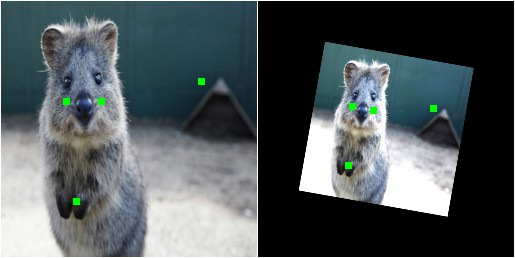

===================
Examples: Keypoints
===================

`imgaug` can handle not only images, but also keypoints/landmarks on these.
E.g. if an image is rotated during augmentation, the library can also rotate
all landmarks correspondingly.

A simple example
----------------

The following example loads an image and places four keypoints on it.
The image is then augmented to be brighter, slightly rotated and scaled.
These augmentations are also applied to the keypoints.
The image is then shown before and after augmentation (with keypoints drawn
on it).

::

    import imgaug as ia
    from imgaug import augmenters as iaa

    ia.seed(1)

    image = ia.quokka(size=(256, 256))
    keypoints = ia.KeypointsOnImage([
        ia.Keypoint(x=65, y=100),
        ia.Keypoint(x=75, y=200),
        ia.Keypoint(x=100, y=100),
        ia.Keypoint(x=200, y=80)
    ], shape=image.shape)

    seq = iaa.Sequential([
        iaa.Multiply((1.2, 1.5)), # change brightness, doesn't affect keypoints
        iaa.Affine(
            rotate=10,
            scale=(0.5, 0.7)
        ) # rotate by exactly 10deg and scale to 50-70%, affects keypoints
    ])

    # Make our sequence deterministic.
    # We can now apply it to the image and then to the keypoints and it will
    # lead to the same augmentations.
    # IMPORTANT: Call this once PER BATCH, otherwise you will always get the
    # exactly same augmentations for every batch!
    seq_det = seq.to_deterministic()

    # Augment keypoints and images.
    # As we only have one image and list of keypoints, we use
    # [image] and [keypoints] to turn both into lists (batches) for the
    # functions and then [0] to reverse that. In a real experiment, your
    # variables would likely already be lists.
    image_aug = seq_det.augment_images([image])[0]
    keypoints_aug = seq_det.augment_keypoints([keypoints])[0]

    # print coordinates before/after augmentation (see below)
    # use after.x_int and after.y_int to get rounded integer coordinates
    for i in range(len(keypoints.keypoints)):
        before = keypoints.keypoints[i]
        after = keypoints_aug.keypoints[i]
        print("Keypoint %d: (%.8f, %.8f) -> (%.8f, %.8f)" % (
            i, before.x, before.y, after.x, after.y)
        )

    # image with keypoints before/after augmentation (shown below)
    image_before = keypoints.draw_on_image(image, size=7)
    image_after = keypoints_aug.draw_on_image(image_aug, size=7)

Console output of the example::

    Keypoint 0: (65.00000000, 100.00000000) -> (94.11840007, 105.19555403)
    Keypoint 1: (75.00000000, 200.00000000) -> (89.69884728, 164.11942850)
    Keypoint 2: (100.00000000, 100.00000000) -> (114.38441167, 108.76899867)
    Keypoint 3: (200.00000000, 80.00000000) -> (174.32927032, 107.39826243)

    Image with keypoints, before (left) and after (right)
    augmentation. Keypoints are shown in green and drawn in after the
    augmentation process.
