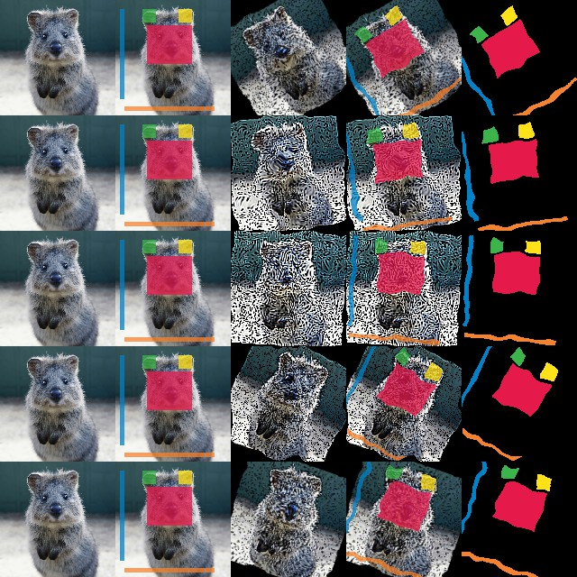
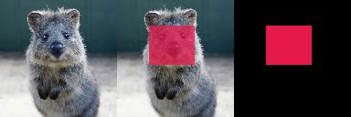
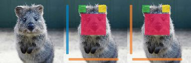

=====================================
Examples: Segmentation Maps and Masks
=====================================

`imgaug` offers support for segmentation map data, such as semantic segmentation maps,
instance segmentation maps or ordinary masks. Segmentation maps can be augmented correspondingly
to images. E.g. if an image is rotated by 45°, the corresponding segmentation map for that image
will also be rotated by 45°.

**Note**:

    * Segmentation map support is currently in a Beta phase. Unittests are not yet finished.
    * All augmentation functions for segmentation map are implemented under the assumption of
      augmenting **ground truth** data. As such, heatmaps will be affected by augmentations that
      change the geometry of images (e.g. affine transformations, cropping, resizing), but not by
      other augmentations (e.g. gaussian noise, saturation changes, grayscaling, dropout, ...).

Features of the library's segmentation map support:

    * Represent segmentation maps as objects (`imgaug.SegmentationMapOnImage`).
    * Support integer maps (integer dtypes, usually int32), boolean masks (`np.bool_`) and float32
      maps (these are essentially identical to heatmaps).
    * Augment segmentation maps (only geometry-affecting augmentations,
      e.g. affine transformations, cropping, ...).
    * Use different resolutions for segmentation maps than for images (e.g. 32x32 segmentation
      maps for 256x256 images).
    * Draw segmentation maps -- on their own or on images (`imgaug.SegmentationMapOnImage.draw()`,
      `imgaug.SegmentationMapOnImage.draw_on_image()`).
    * Resize segmentation maps (`imgaug.SegmentationMapOnImage.scale()`).
    * Pad segmentation maps by pixel amounts or to desired aspect ratios
      (`imgaug.SegmentationMapOnImage.pad()`,
      `imgaug.SegmentationMapOnImage.pad_to_aspect_ratio()`).

A simple example
----------------

The following example loads a standard image and a generates a corresponding int32
segmentation map. The image and segmentation map are augmented in the same way and the results
are visualized.

::

    import imgaug as ia
    from imgaug import augmenters as iaa
    import imageio
    import numpy as np

    ia.seed(1)

    # Load an example image (uint8, 128x128x3).
    image = ia.quokka(size=(128, 128), extract="square")

    # Create an example segmentation map (int32, 128x128).
    # Here, we just randomly place some squares on the image.
    # Class 0 is the background class.
    segmap = np.zeros((128, 128), dtype=np.int32)
    segmap[28:71, 35:85] = 1
    segmap[10:25, 30:45] = 2
    segmap[10:25, 70:85] = 3
    segmap[10:110, 5:10] = 4
    segmap[118:123, 10:110] = 5
    segmap = ia.SegmentationMapOnImage(segmap, shape=image.shape, nb_classes=1+5)

    # Define our augmentation pipeline.
    seq = iaa.Sequential([
        iaa.Dropout([0.05, 0.2]),      # drop 5% or 20% of all pixels
        iaa.Sharpen((0.0, 1.0)),       # sharpen the image
        iaa.Affine(rotate=(-45, 45)),  # rotate by -45 to 45 degrees (affects heatmaps)
        iaa.ElasticTransformation(alpha=50, sigma=5)  # apply water effect (affects heatmaps)
    ], random_order=True)

    # Augment images and heatmaps.
    images_aug = []
    segmaps_aug = []
    for _ in range(5):
        seq_det = seq.to_deterministic()
        images_aug.append(seq_det.augment_image(image))
        segmaps_aug.append(seq_det.augment_segmentation_maps([segmap])[0])

    # We want to generate an image of original input images and heatmaps before/after augmentation.
    # It is supposed to have five columns: (1) original image, (2) augmented image,
    # (3) augmented heatmap on top of augmented image, (4) augmented heatmap on its own in jet
    # color map, (5) augmented heatmap on its own in intensity colormap,
    # We now generate the cells of these columns.
    #
    # Note that we add a [0] after each heatmap draw command. That's because the heatmaps object
    # can contain many sub-heatmaps and hence we draw command returns a list of drawn sub-heatmaps.
    # We only used one sub-heatmap, so our lists always have one entry.
    cells = []
    for image_aug, segmap_aug in zip(images_aug, segmaps_aug):
        cells.append(image)                                      # column 1
        cells.append(segmap.draw_on_image(image))                # column 2
        cells.append(image_aug)                                  # column 3
        cells.append(segmap_aug.draw_on_image(image_aug))        # column 4
        cells.append(segmap_aug.draw(size=image_aug.shape[:2]))  # column 5

    # Convert cells to grid image and save.
    grid_image = ia.draw_grid(cells, cols=5)
    imageio.imwrite("example_segmaps.jpg", grid_image)

    Results of the above example code. Columns show: (1) Original image, (2) original
    segmentation map drawn on original image, (3) augmented image, (4) augmented segmentation
    map drawn on augmented image, (5) augmented segmentation map on its own.

Using boolean masks
-------------------

In order to augment masks, you can simply use boolean arrays. Everything else is identical
to int32 maps. The below code shows an example and is very similar to the previous code for int32
maps. It noteably changes `np.zeros((128, 128), dtype=np.int32)`
to `np.zeros((128, 128), dtype=bool)`.

::

    import imgaug as ia
    import imageio
    import numpy as np

    # Load an example image (uint8, 128x128x3).
    image = ia.quokka(size=(128, 128), extract="square")

    # Create an example mask (bool, 128x128).
    # Here, we just randomly place a square on the image.
    segmap = np.zeros((128, 128), dtype=bool)
    segmap[28:71, 35:85] = True
    segmap = ia.SegmentationMapOnImage(segmap, shape=image.shape)

    # Draw three columns: (1) original image, (2) original image with mask on top, (3) only mask
    cells = [
        image,
        segmap.draw_on_image(image),
        segmap.draw(size=image.shape[:2])
    ]

    # Convert cells to grid image and save.
    grid_image = ia.draw_grid(cells, cols=3)
    imageio.imwrite("example_segmaps_bool.jpg", grid_image)

    Results of the above example code. Columns show: (1) Original image, (2) boolean segmentation
    map (i.e. mask) drawn on image, (3) boolean segmentation map drawn on its own.

Accessing the segmentation map array
------------------------------------

After augmentation it is often desired to re-access the segmentation map array. This can be done
using `SegmentationMapOnImage.get_arr_int([background_threshold], [background_class_id])`,
which returns an int32 array. The two background parameters are related to converting float32
heatmaps to int32 arrays (the segmentation map is handled by the library as a set of heatmaps).
The parameters can usually be ignored.

The below code shows an example that accesses and changes the array.

::

    import imgaug as ia
    import imageio
    import numpy as np

    # Load an example image (uint8, 128x128x3).
    image = ia.quokka(size=(128, 128), extract="square")

    # Create an example segmentation map (int32, 128x128).
    # Here, we just randomly place some squares on the image.
    # Class 0 is the background class.
    segmap = np.zeros((128, 128), dtype=np.int32)
    segmap[28:71, 35:85] = 1
    segmap[10:25, 30:45] = 2
    segmap[10:25, 70:85] = 3
    segmap[10:110, 5:10] = 4
    segmap[118:123, 10:110] = 5
    segmap1 = ia.SegmentationMapOnImage(segmap, shape=image.shape, nb_classes=1+5)

    # Read out the segmentation map's array, change it and create a new segmentation map
    arr = segmap1.get_arr_int()
    arr[10:110, 5:10] = 5
    segmap2 = ia.SegmentationMapOnImage(arr, shape=image.shape, nb_classes=1+5)

    # Draw three columns: (1) original image, (2) original image with unaltered segmentation
    # map on top, (3) original image with altered segmentation map on top
    cells = [
        image,
        segmap1.draw_on_image(image),
        segmap2.draw_on_image(image)
    ]

    # Convert cells to grid image and save.
    grid_image = ia.draw_grid(cells, cols=3)
    imageio.imwrite("example_segmaps_array.jpg", grid_image)

    Results of the above example code. Columns show: (1) Original image, (2) original
    segmentation map drawn on original image, (3) segmentation map with modified array drawn on
    image.

Resizing and padding
--------------------

Segmentation maps can be easily resized and padded. The methods are identical to the ones used
for heatmaps (see :doc:`examples_heatmaps`), though segmentation maps are not offering resizing
via average or max pooling. Note that segmentation maps are handled internally as heatmaps (one
per class) and as such can be resized using cubic interpolation.
The functions for resizing and padding are:

  * `SegmentationMapOnImage.scale(sizes, interpolation="cubic")`: Resizes to `sizes` given as
    a tuple `(height, width)`. Interpolation can be `nearest`, `linear`, `cubic`, `area`.
  * `SegmentationMapOnImage.pad(top=0, right=0, bottom=0, left=0, mode="constant", cval=0.0)`:
    Pads the segmentation map by given pixel amounts. Uses by default constant value padding with
    value 0.0, i.e. zero-padding. Padding is applied to segmentation maps as heatmaps (can be
    imagined as probability maps), making values between 0.0 and 1.0 possible. However, only
    0.0 is recommended for for constant value padding. Possible padding modes are the same as
    for `numpy.pad()`, i.e. `constant`, `edge`, `linear_ramp`, `maximum`, `mean`, `median`,
    `minimum`, `reflect` `symmetric` `wrap`.
  * `SegmentationMapOnImage.pad_to_aspect_ratio(aspect_ratio, mode="constant", cval=0.0, return_pad_amounts=False)`:
    Same as `pad()`, but pads an image towards a desired aspect ratio (`width/height`). E.g. use
    `1.0` for squared images or `2.0` for images that are twice as wide as they are high.
