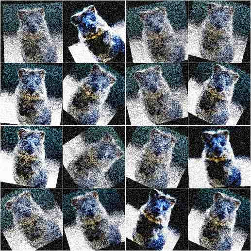

=====================
Stochastic Parameters
=====================

------------
Introduction
------------

When augmenting images during experiments, usually one wants to augment each
image in different ways. E.g. when rotating images, not every image is supposed
to be rotated by 10 degrees. Instead, only some are supposed to be rotated
by 10 degrees, while others should be rotated by 17 degrees or 5 degrees
or -12 degrees - and so on. This can be achieved using random functions,
but reimplementing these, making sure that they generate the expected values
and getting them to work with *determinism* is cumbersome. To avoid all of
this work, the library uses *Stochastic Parameters*. These are usually
abstract representations of probability distributions, e.g. the normal
distribution `N(0, 1.0)` or the uniform range `[0.0, 10.0]`.
Basically all augmenters accept these stochastic parameters, making it easy
to control value ranges. They are all adapted to work with *determinism*
out of the box.

The below code shows their usage::

    from imgaug import augmenters as iaa
    from imgaug import parameters as iap

    seq = iaa.Sequential([
        iaa.GaussianBlur(
            sigma=iap.Uniform(0.0, 1.0)
        ),
        iaa.ContrastNormalization(
            iap.Choice(
                [1.0, 1.5, 3.0],
                p=[0.5, 0.3, 0.2]
            )
        ),
        iaa.Affine(
            rotate=iap.Normal(0.0, 30),
            translate_px=iap.RandomSign(iap.Poisson(3))
        ),
        iaa.AddElementwise(
            iap.Discretize(
                (iap.Beta(0.5, 0.5) * 2 - 1.0) * 64
            )
        ),
        iaa.Multiply(
            iap.Positive(iap.Normal(0.0, 0.1)) + 1.0
        )
    ])

The example does the following:
    * Blur each image by `sigma`, where `sigma` is sampled from the uniform range `[0.0, 1.0)`. Example values: `0.053, 0.414, 0.389, 0.277, 0.981`.
    * Increase the contrast either to 100% (50% chance of being chosen) or by 150% (30% chance of being chosen) or 300% (20% chance of being chosen).
    * Rotate each image by a random amount of degrees, where the degree is sampled from the normal distribution `N(0, 30)`. Most of the values will be in the range `-60` to `60`.
    * Translate each image by n pixels, where n is sampled from a poisson distribution with alpha=3 (pick should be around x=3).
      As we cant translate by a fraction of a pixel, we pick a discrete distribution here, which poisson is.
      However, we do not just want to translate towards the right/top (only positive values).
      So we randomly flip the sign sometimes to get negative pixel amounts too.
    * Add to each pixel a random value, sampled from the beta distribution `Beta(0.5, 0.5)`.
      This distribution has its peaks around 0.0 and 1.0.
      We multiply this with 2 and subtract 1 to get it into the range `[-1, 1]`.
      Then we multiply by 64 to get the range `[-64, 64]`.
      As we beta distribution is continuous, we convert it to a discrete distribution.
      The result is that a lot of pixel intensities are shifted by -64 or 64 (or a value very close to these two).
      Some other pixel intensities are kept (mostly) at their old values.
    * We use Multiply to make each image brighter.
      The brightness increase is sampled from a normal distribution, converted to have only positive values.
      So most values are expected to be in the range `0.0` to `0.2`.
      We add `1.0` to set the brightness to `1.0` (100%) to `1.2` (120%).

------------------------------------
Continuous Probability Distributions
------------------------------------

The following continuous probability distributions are available:

    * `Normal(loc, scale)`: The popular normal distribution with mean `loc` and standard deviation `scale`.
      Example::

           from imgaug import parameters as iap
           params = [
               iap.Normal(0, 1),
               iap.Normal(5, 3),
               iap.Normal(iap.Choice([-3, 3]), 1),
               iap.Normal(iap.Uniform(-3, 3), 1)
           ]
           iap.show_distributions_grid(params)

      .. figure:: ../images/parameters/continuous_normal.jpg
          :alt: Examples of normal distributions

    * `Laplace(loc, scale)`: Similarly shaped to a normal distribution. Has its peak at `loc` and width `scale`.
      Example::

          from imgaug import parameters as iap
          params = [
              iap.Laplace(0, 1),
              iap.Laplace(5, 3),
              iap.Laplace(iap.Choice([-3, 3]), 1),
              iap.Laplace(iap.Uniform(-3, 3), 1)
          ]
          iap.show_distributions_grid(params)

      .. figure:: ../images/parameters/continuous_laplace.jpg
          :alt: Examples of laplace distributions

    * `ChiSquare(df)`: The chi-square ("X^2") distribution with `df` degrees of freedom.
       Roughly similar to a continuous version of the poisson distribution.
       Has its peak at `df` and no negative values, only positive ones.
       Example::

           from imgaug import parameters as iap
           params = [
               iap.ChiSquare(1),
               iap.ChiSquare(3),
               iap.ChiSquare(iap.Choice([1, 5])),
               iap.RandomSign(iap.ChiSquare(3))
           ]
           iap.show_distributions_grid(params)

       .. figure:: ../images/parameters/continuous_chisquare.jpg
           :alt: Examples of chi-square distributions

    * `Weibull(a)`: Weibull distribution with shape `a`.
      Example::

          from imgaug import parameters as iap
          params = [
              iap.Weibull(0.5),
              iap.Weibull(1),
              iap.Weibull(1.5),
              iap.Weibull((0.5, 1.5))
          ]
          iap.show_distributions_grid(params)

      .. figure:: ../images/parameters/continuous_weibull.jpg
          :alt: Examples of Weibull distributions

    * `Uniform(a, b)`: Uniform distribution in the range `[a, b)`.
      Example::

          from imgaug import parameters as iap
          params = [
              iap.Uniform(0, 1),
              iap.Uniform(iap.Normal(-3, 1), iap.Normal(3, 1)),
              iap.Uniform([-1, 0], 1),
              iap.Uniform((-1, 0), 1)
          ]
          iap.show_distributions_grid(params)

      .. figure:: ../images/parameters/continuous_uniform.jpg
          :alt: Examples of Uniform distributions

    * `Beta(alpha, beta)`: Beta distribution with parameters `alpha` and `beta`.
      Example::

          from imgaug import parameters as iap
          params = [
              iap.Beta(0.5, 0.5),
              iap.Beta(2.0, 2.0),
              iap.Beta(1.0, 0.5),
              iap.Beta(0.5, 1.0)
          ]
          iap.show_distributions_grid(params)

      .. figure:: ../images/parameters/continuous_beta.jpg
          :alt: Examples of Beta distributions

----------------------------------
Discrete Probability Distributions
----------------------------------

The following discrete probability distributions are available:

    * `Binomial(p)`: The common binomial distribution with probability `p`.
      Useful to simulate coinflips.
      Example::

        from imgaug import parameters as iap
        params = [
            iap.Binomial(0.5),
            iap.Binomial(0.9)
        ]
        iap.show_distributions_grid(params)

      .. figure:: ../images/parameters/continuous_binomial.jpg
          :alt: Examples of Binomial distributions

    * `DiscreteUniform(a, b)`: The discrete uniform distribution in the range `[a..b]`.
      Example::

          from imgaug import parameters as iap
          params = [
              iap.DiscreteUniform(0, 10),
              iap.DiscreteUniform(-10, 10),
              iap.DiscreteUniform([-10, -9, -8, -7], 10),
              iap.DiscreteUniform((-10, -7), 10)
          ]
          iap.show_distributions_grid(params)

      .. figure:: ../images/parameters/continuous_discreteuniform.jpg
          :alt: Examples of DiscreteUniform distributions

    * `Poisson(lam)`: Poisson distribution with shape `lam`. Generates no negative values.
      Example::

          from imgaug import parameters as iap
          params = [
              iap.Poisson(1),
              iap.Poisson(2.5),
              iap.Poisson((1, 2.5)),
              iap.RandomSign(iap.Poisson(2.5))
          ]
          iap.show_distributions_grid(params)

      .. figure:: ../images/parameters/continuous_poisson.jpg
          :alt: Examples of Poisson distributions

----------
Arithmetic
----------

The library supports arithmetic operations on stochastic parameters.
This allows to modify values sampled from distributions or combine several
distributions with each other.

    * `Add(param, val, elementwise)`: Add `val` to the values sampled from
      `param`. The shortcut is `+`, e.g. `Uniform(...) + 1`.
      `val` can be a stochastic parameter itself. Usually, only one
      value is sampled from `val` per sampling run and added to all
      samples generated by `param`. Alternatively, `elementwise` can be set
      to `True` in order to generate as many samples from `val` as from `param`
      and add them elementwise. Note that `Add` merely adds to the results
      of `param` and does *not* combine probability density functions
      (see e.g. example image 3 and 4). Example::

          from imgaug import parameters as iap
          params = [
              iap.Uniform(0, 1) + 1, # identical to: Add(Uniform(0, 1), 1)
              iap.Add(iap.Uniform(0, 1), iap.Choice([0, 1], p=[0.7, 0.3])),
              iap.Normal(0, 1) + iap.Uniform(-5.5, -5) + iap.Uniform(5, 5.5),
              iap.Normal(0, 1) + iap.Uniform(-7, 5) + iap.Poisson(3),
              iap.Add(iap.Normal(-3, 1), iap.Normal(3, 1)),
              iap.Add(iap.Normal(-3, 1), iap.Normal(3, 1), elementwise=True)
          ]
          iap.show_distributions_grid(
              params,
              rows=2,
              sample_sizes=[ # (iterations, samples per iteration)
                  (1000, 1000), (1000, 1000), (1000, 1000),
                  (1000, 1000), (1, 100000), (1, 100000)
              ]
          )

      .. figure:: ../images/parameters/arithmetic_add.jpg
          :alt: Examples of using Add

    * `Subtract(param, val, elementwise)`: Same as `Add`, but subtracts `val`
      from the results of `param`. The shortcut is `-`,
      e.g. `Uniform(...) - 1`.

    * `Multiply(param, val, elementwise)`: Same as `Add`, but multiplies `val`
      with the results of `param`. The shortcut is `*`,
      e.g. `Uniform(...) * 2`. Example::

          from imgaug import parameters as iap
          params = [
              iap.Uniform(0, 1) * 2, # identical to: Multiply(Uniform(0, 1), 2)
              iap.Multiply(iap.Uniform(0, 1), iap.Choice([0, 1], p=[0.7, 0.3])),
              (iap.Normal(0, 1) * iap.Uniform(-5.5, -5)) * iap.Uniform(5, 5.5),
              (iap.Normal(0, 1) * iap.Uniform(-7, 5)) * iap.Poisson(3),
              iap.Multiply(iap.Normal(-3, 1), iap.Normal(3, 1)),
              iap.Multiply(iap.Normal(-3, 1), iap.Normal(3, 1), elementwise=True)
          ]
          iap.show_distributions_grid(
              params,
              rows=2,
              sample_sizes=[ # (iterations, samples per iteration)
                  (1000, 1000), (1000, 1000), (1000, 1000),
                  (1000, 1000), (1, 100000), (1, 100000)
              ]
          )

      .. figure:: ../images/parameters/arithmetic_multiply.jpg
          :alt: Examples of using Multiply

    * `Divide(param, val, elementwise)`: Same as `Multiply`, but divides by
      `val`. The shortcut is `/`, e.g. `Uniform(...) / 2`. Division by zero
      is automatically prevented (zeros are replaced by ones). Example::

          from imgaug import parameters as iap
          params = [
              iap.Uniform(0, 1) / 2, # identical to: Divide(Uniform(0, 1), 2)
              iap.Divide(iap.Uniform(0, 1), iap.Choice([0, 2], p=[0.7, 0.3])),
              (iap.Normal(0, 1) / iap.Uniform(-5.5, -5)) / iap.Uniform(5, 5.5),
              (iap.Normal(0, 1) * iap.Uniform(-7, 5)) / iap.Poisson(3),
              iap.Divide(iap.Normal(-3, 1), iap.Normal(3, 1)),
              iap.Divide(iap.Normal(-3, 1), iap.Normal(3, 1), elementwise=True)
          ]
          iap.show_distributions_grid(
              params,
              rows=2,
              sample_sizes=[ # (iterations, samples per iteration)
                  (1000, 1000), (1000, 1000), (1000, 1000),
                  (1000, 1000), (1, 100000), (1, 100000)
              ]
          )

      .. figure:: ../images/parameters/arithmetic_divide.jpg
          :alt: Examples of using Divide

    * `Power(param, val, elementwise)`: Same as `Add`, but raises sampled
      values to the exponent `val`. The shortcut is `**`. Example::

          from imgaug import parameters as iap
          params = [
              iap.Uniform(0, 1) ** 2, # identical to: Power(Uniform(0, 1), 2)
              iap.Clip(iap.Uniform(-1, 1) ** iap.Normal(0, 1), -4, 4)
          ]
          iap.show_distributions_grid(params, rows=1)

      .. figure:: ../images/parameters/arithmetic_power.jpg
          :alt: Examples of using Power

------------------
Special Parameters
------------------

    * `Deterministic(v)`: A constant. Upon sampling, this always returns `v`.
    * `Choice(values, replace=True, p=None)`: Upon sampling, this parameter
      picks randomly elements from a list `values`. If `replace` is set to
      `True` (default), the picking happens with replacement. By default,
      all elements have the same probability of being picked. This can be
      modified using `p`. Note that `values` may also contain strings
      and other stochastic parameters. In the latter case, each picked
      parameter will be replaced by a sample from that parameter. This allows
      merging of probability mass functions, but is a rather slow process.
      All elements in `values` should have the same datatype (except for
      stochastic parameters). Example::

          from imgaug import parameters as iap
          params = [
              iap.Choice([0, 1, 2]),
              iap.Choice([0, 1, 2], p=[0.15, 0.5, 0.35]),
              iap.Choice([iap.Normal(-3, 1), iap.Normal(3, 1)]),
              iap.Choice([iap.Normal(-3, 1), iap.Poisson(3)])
          ]
          iap.show_distributions_grid(params)

      .. figure:: ../images/parameters/special_choice.jpg
          :alt: Examples of using Choice

    * `Clip(param, minval=None, maxval=None)`: Clips the values sampled from
      `param` to the range `[minval, maxval]`. `minval` and `maxval` may be
      `None`. In that case, only minimum or maximum clipping is applied
      (depending on what is `None`). Example::

          from imgaug import parameters as iap
          params = [
              iap.Clip(iap.Normal(0, 1), -2, 2),
              iap.Clip(iap.Normal(0, 1), -2, None)
          ]
          iap.show_distributions_grid(params, rows=1)

      .. figure:: ../images/parameters/special_clip.jpg
          :alt: Examples of using Clip

    * `Discretize(param)`: Converts a continuous parameter `param` into a
      discrete one (using rounding). Discrete parameters are not changed.
      Example::

          from imgaug import parameters as iap
          params = [
              iap.Discretize(iap.Normal(0, 1)),
              iap.Discretize(iap.ChiSquare(3))
          ]
          iap.show_distributions_grid(params, rows=1)

      .. figure:: ../images/parameters/special_discretize.jpg
          :alt: Examples of using Discretize

    * `Absolute(param)`: Applies an absolute function to each value sampled
      from `param`, turning them to positive ones. Example::

          from imgaug import parameters as iap
          params = [
              iap.Absolute(iap.Normal(0, 1)),
              iap.Absolute(iap.Laplace(0, 1))
          ]
          iap.show_distributions_grid(params, rows=1)

      .. figure:: ../images/parameters/special_absolute.jpg
          :alt: Examples of using Absolute

    * `RandomSign(param, p_positive=0.5)`: Randomly flips the signs
      of values sampled from `param`. Optionally, the probability of flipping
      a value's sign towards positive can be set. Example::

          from imgaug import parameters as iap
          params = [
              iap.ChiSquare(3),
              iap.RandomSign(iap.ChiSquare(3)),
              iap.RandomSign(iap.ChiSquare(3), p_positive=0.75),
              iap.RandomSign(iap.ChiSquare(3), p_positive=0.9)
          ]
          iap.show_distributions_grid(params)

      .. figure:: ../images/parameters/special_randomsign.jpg
          :alt: Examples of using RandomSign

    * `ForceSign(param, positive, mode="invert", reroll_count_max=2)`:
      Converts all values sampled from `param` to positive or negative ones.
      Signs of positive/negative values may simply be flipped (`mode="invert"`)
      or resampled from param (mode="reroll"). When rerolling, the number of
      iterations is limited to `reroll_count_max` (afterwards mode="invert" is
      used). Example::

          from imgaug import parameters as iap
          params = [
              iap.ForceSign(iap.Normal(0, 1), positive=True),
              iap.ChiSquare(3) - 3.0,
              iap.ForceSign(iap.ChiSquare(3) - 3.0, positive=True, mode="invert"),
              iap.ForceSign(iap.ChiSquare(3) - 3.0, positive=True, mode="reroll")
          ]
          iap.show_distributions_grid(params)

      .. figure:: ../images/parameters/special_forcesign.jpg
          :alt: Examples of using ForceSign

    * `Positive(other_param, mode="invert", reroll_count_max=2)`:
      Shortcut for `ForceSign` with `positive=True`. E.g.
      `Positive(Normal(0, 1))` restricts a normal distribution to only positive
      values.
    * `Negative(other_param, mode="invert", reroll_count_max=2)`:
      Shortcut for `ForceSign` with `positive=False`. E.g.
      `Negative(Normal(0, 1))` restricts a normal distribution to only negative
      values.
    * `FromLowerResolution(other_param, size_percent=None, size_px=None, method="nearest", min_size=1)`:
      Intended for 2d-sampling processes, e.g. for masks. Samples these in
      a lower resolution space. E.g. instead of sampling a mask at 100x100,
      this allows to sample it at 10x10 and then upsample to 100x100.
      One advantage is, that this can be faster. Another possible use is, that
      the upsampling may result in large, correlated blobs (linear interpolation)
      or rectangles (nearest neighbour interpolation).

----------------
Noise Parameters
----------------

TODO
